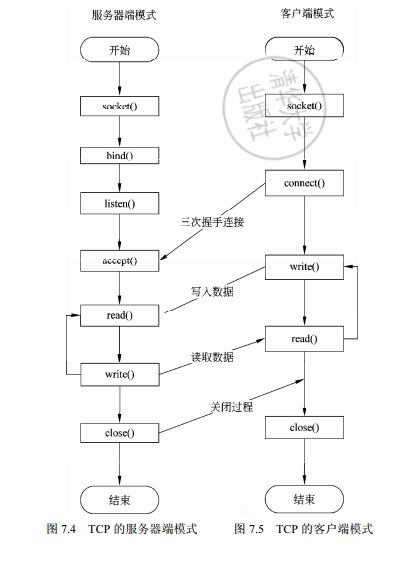
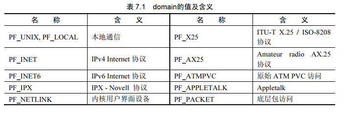
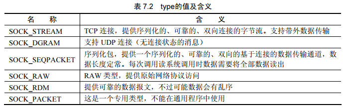
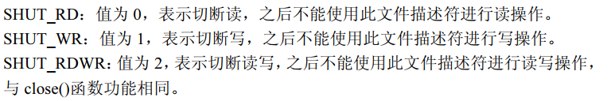

# 第4章 程序、进程、线程

**进程**：是运行着的程序，操作系统资源分配的基本单位（内存，CPU时间片等），也是计算机运行的基本单位，有进程控制表PCB,系统通过PCB对进程进行调度。

**应用程序**：作为一个静态文件存储在计算机系统的硬盘空间中

l 进程是动态的，而程序是静态的

l 进程有一定的生命周期，而程序是指令的集合

l 一个进程只能对应一个程序，一个程序可以对应多个进程，

**线程**：为了节省资源而可以在同一个进程中共享资源的最小执行单位，有线程控制表TCB，TCB所表示的状态比PCB少得多，优点：系统资源消耗低；速度快；线程间的数据共享比进程间容易得多。

**进程的产生方式有：**fork()函数，system()函数，exec()函数等。

**进程号**：每个进程初始化时系统都会分配一个ID,用于标识进程，叫PID，

getpid()：返回当前进程ID，getppid()：返回父进程ID

**fork()进程复制：**以父进程为蓝本复制一个进程，其ID号和父进程ID号不同，只有内存与父进程不同，其他与父进程共享，只有在父进程或子进程进行修改后才重新生成一份。fork()的特点：执行一次返回两次，父进程中返回的是子进程的ID号，子进程返回0.

**system()函数:**调用shell的外部命令在当前进程中开始另一个进程，调用“/bin/sh-c command”执行特定的命令，阻塞当前进程直到command命令执行完毕。

**exec()函数：在使用**fork()函数，system()函数中，系统会建立一个新的进程，执行调用者的操作，原进程还存在，直到用户显式退出，而exec()函数会使用新进程代替原有的进程，系统会从新的进程运行，新进程的PID与原来进程的PID相同。

**初始进程init**:所有进程都有父子或兄弟，除了初始进程init，它是所有进程的祖先，其他进程都是由init进程直接或间接fork（）出来的。

 

**进程间的通信(IPC)**主要方式：管道，共享内存，消息队列，信号量

**管道**：利用内核在两个进程之间建立通道，特点是与文件操作类似，仅仅在管道的一端只读，另一端只写，利用读写的方式在进程之间传递数据，管道的操作是阻塞性质的。

  进程创建管道，每次创建两个文件描述符来操作管道，其中一个对管道进行写操作，另一个描述符对管道进行读操作，在进程A中设置为读的管道文件描述符在进程B中要设置为写，反之。

**共享内存**：将内存中的一段地址在多个进程之间共享（在多个进程之间对内存段进行映射的方式实现内存共享），多个进程利用获得的共享内存的地址直接对内存进行操作。

**消息队列：**在内核中建立一个链表，发送方按照一定的标识将数据发送到内核中，内核将其放入链表后，等待接收方的请求；接收方发送请求后，内核按照消息的标识，从内核中将消息从链表中摘下，传递给接收方。消息队列是一种完全异步的操作方式。

**进程的同步**方式主要有：消息队列，信号量

**信号量**：是一个共享的表示数量的计数器，用于控制多个进程对共享资源的访问（生产者和消费者），是进程间同步的最主要方式。公共资源增加的时候信号量的值增加，消耗的时候，信号量的值减小，只有信号量的值大于0时，才能访问信号量所代表的公共资源。

**信号**：古老的进程间通信机制，用于在一个或多个进程间传递异步信号。可以由内核或其他进程产生、各种异步事件产生，如键盘中断。signal()函数用于截取系统信号，对此信号挂接用户自己的处理函数。

**互斥锁：**用来保护一段临界区，保证某一时间段只有一个线程在执行一段代码或访问某一资源。当线程执行到pthread_mutex_lock（）函数时，如果此时该锁被另一个线程使用，当前线程阻塞，等待另一线程释放此锁。

# 第5章 TCP/IP协议族

ISO/OSI开放互联**标准模型**

                               

TCP/IP协议栈参考模型：应用层、传输层、网络层、数据链路层

**物理层**：给上一层提供访问接口，为IP协议和ARP协议提供服务、发送和接收网络数据报。

**网络层**：定义数据包的分组格式和协议—IP协议，因此又称IP层，将数据包分组路由，有路由、网际互联、拥塞控制等，网际控制报文协议ICMP，地址识别协议ARP。

**IP协议**：

l 数据传送：将数据从一个主机传输到另一主机。

l 寻址：根据子网划分和IP地址，发现正确的目的主机

l 路由选择：选择数据在互联网上的传输路径

l 数据报分段：数据大于MTU时，将数据进行分段发送和接收组装

结构：头部（20字节）+数据

 

总长度：该报文的长度（头部+数据），最大2^16-1字节

标识和片偏移：用于标识数据包，便于重组，片偏移指出该包位于正在重组的IP报文的偏移量

生存时间TTL：表示报文最多可以经过路由器数量。

协议类型：根据协议类型将数据包发往那个层的协议做相关的处理

校验和：使用循环冗余校验生成，保证IP帧的完整性

**ICMP**:报告网路上的某些出错情况，允许网际路由传输差错信息、时间、回显、网络信息等报文控制数据。位于IP字段的数据部分（插入其中，被IP报文传输）。

结构：

 

类型：表示15种不同类型的ICMP报文

代码（8-15）图错了：用于对类型字段ICMP报文的详细规定

校验和:范围覆盖整个ICMP报文（头部和数据），校验方法和IP一致

ICMP报文类型由类型和代码决定，主要有：目的不可达、时间戳请求应答、回显请求应答、地址掩码请求应答。

**ARP协议**:32位IP地址和48位局域网地址之间执行翻译，建立IP地址和硬件地址的映射关系。在网际网中数据传输的目的地址是IP，在局域网中得知道设备的硬件地址才能向目的主机发送数据。ARP的高速缓存维持这种映射关系，存放最近IP地址到硬件地址的映射记录，每项记录生存时间为20分钟。实现方式：在以太网广播，查询目的IP地址，接收到ARP请求的主机响应请求方，将本机MAC地址反馈回去。

**A Ping B过程**：

1、对ping指令，先判断是主机名还是IP地址，是主机名通过DNS域名解析将主机名换成IP地址。

2、Ping程序向目的IP地址发送一个ICMP的echo包

3、由于A和B在同一个局域网，必须使用ARP协议将目标主机的IP地址转换为硬件地址，通过发送ARP请求广播来查找B的硬件地址

4、B接收到ARP请求后，将本机硬件地址作为A的ARP应答

5、接着A发送ICMP数据包到主机B

6、B收到A的ICMP包，发送响应包

7、A接收B的ICMP响应包

 

**传输层：**提供源主机和目标主机上的对等层之间可以进行会话的机制，有传输控制协议TCP，用户数据报协议UDP，

**TCP**:面向连接，可靠传输。利用IP层的机制在不可靠连接的基础上实现可靠连接，通过发送窗口控制、超时重发、分包等方法将一台主机发出的字节流发往其他主机。位于IP字段的数据部分（插入其中，被IP报文传输）。

l 字节流服务：传输的数据可视为无结构的字节流，

l 面向连接：传输前先建立连接（三次、四次）

l 可靠传输：基于校验和应答重发机制保证可靠性，如果校验后有误不发送应答，发送方在超时后会自动重发

l 缓冲传输：可以延迟数据传输，允许将数据积攒到一定数量进行传输

l 全双工

l 流量控制：滑动窗口机制

结构：

 

端口号：用于确认发送端和接收端的应用程序

序列号：用来标识应用程序从TCP的发送端到接收端发送的字节流。当TCP连接时，发送一个序列号给接收端，连接成功后，这个序列号作为初始序列号ISN。确认号：接收方接收发送方发来的序列号后，+1作为确认号，发送再次发送时从确认号开始。

窗口尺寸：接收窗口大小，标识本机上TCP协议可以接收的以字节为单位的数目

选项：经常用于最大分段长度MSS，指明当前主机所能接收的最大报文长度。

**三次握手**：

刚开始客户端处于 closed 的状态，服务端处于 listen 状态。然后

1.第一次握手：客户端给服务端发一个 SYN 报文，并指明客户端的初始化序列号 ISN(c)和想要连接的主机端口。此时客户端处于SYN_Send 状态。

2.第二次握手：服务器收到客户端的 SYN 报文后，以自己的 SYN 报文作为应答，并且也是指定了自己的初始化序列号 ISN(s)，同时会把客户端的 ISN + 1 作为 ACK 的值发送回去，表示自已经收到了客户端的 SYN，此时服务器处于 SYN_REVD 的状态。

3.第三次握手：客户端收到 SYN 报文之后，会发送一个 ACK 报文，当然，也是一样把服务器的 ISN + 1 作为 ACK的值，表示已经收到了服务端的 SYN 报文，此时客户端处于 establised 状态。

服务器收到 ACK 报文之后，也处于 establised 状态，此时，双方已建立起了链接

 

**三次握手的作用：**

确认双方的接受能力、发送能力是否正常

指定自己的初始化序列号，为后面的可靠传送做准备。

**序列号 ISN（Initial Sequence Number）是固定的吗**

ISN 是动态生成的，如果ISN是固定的，攻击者很容易猜出后续的确认号

ISN以便让对方知道接下来接收数据的时候如何按序列号组装数据。

 

**四次挥手：**

双⽅都处于 establised 状态，假如是客户端先发起关闭请求，则：

1.第一次挥手：客户端发送一个 FIN 报文，报文中会指定一个序列号。此时客户端处于FIN_WAIT状态

2.第二次挥手：服务端收到 FIN 之后，把客户端的序列号值 + 1 作为 ACK 报文的序列号值发送回去，表明已经收到客户端的报文了，此时服务端处于 CLOSE_WAIT状态。

\3. 第三次挥手：如果服务端也想断开连接了，和客户端的第一次挥手一样，发送 FIN 报文，且指定一个序列号。此时服务端处于 LAST_ACK 的状态。

\4. 第四次挥手：客户端收到 FIN 之后，把服务端的序列号值 + 1 作为 ACK 报文的序列号值发送回去，此时客户端处于 TIME_WAIT 状态。需要过一阵子以确保服务端收到自己的 ACK 报文之后才会进入 CLOSED 状态

5.服务端收到 ACK 报文之后，就处于关闭连接了，处于 CLOSED 状态。

 

**UDP**:无连接，不可靠，速度比TCP快，协议简单得多，对系统造成的负载低。不提供发送包的顺序，接收方不向发送方接收确认信息，出现丢包也无反馈。使用UDP的应用程序必须自己构建发送数据的顺序机制和发送接收的确认机制，来保证数据正确到达、数据顺序和发送数据一致。

 

端口号：用于确认发送端和接收端的UDP端口

数据长度：头部和数据段的长度，单位字节

校验和：使用循环冗余校验生成

 

**应用层**：

 

 

 

 

**最大传输单元MTU**：IP层有一个要传输的数据比MTU大，在IP层数据要进行分片，使得每片小于MTU

 

**IP地址**=类别+网络标识+主机标识

类别：区分IP地址的类型

网络标识:表示主机所在网络

主机标识：标识主机在网络中的标识

 

A类地址(1~126)：网络号占前8位，以0开头，主机号占后24位。分配给拥有大量主机的网络，一些大公司和因特网主干网络

B类地址(128~191)：网络号占前16位，以10开头，主机号占后16位。分配给结点比较多的网络，区域网

C类地址(192~223)：网络号占前24位，以110开头，主机号占后8位。分配给结点比较少的网络，校园网

D类地址(224~239)：以1110开头，保留为多播地址。

E类地址(240~255)：以1111开头，保留为今后使用

 

**子网掩码**：便于网络设备快速寻址，区分本网段地址和非本网段地址。使用子网掩码可以得到一个IP地址的网络地址（类别），子网地址（网络标识），主机地址（主机标识）。可以通过比较两个IP地址分别对子网掩码进行与运算后的值来判断是否属于同一网段。

**端口：**为了方便多种应用程序，区分不同应用程序的数据和状态，引入了端口概念。如果是服务程序，则需要对某个端口进行绑定，这样客户端可以访问本主机上的此端口来与应用程序进行通信。IP地址只能对主机进行区分，而加上端口号就可以区分此主机上的应用程序。通过IP地址和端口号的组合可以确定网络上一个程序通路，端口号实际上是操作系统标识应用程序的一种方法。

1024以下的端口：保留端口，标准服务程序使用，Web服务器端口：80，电子邮件SMTP端口：25，文件传输FTP端口：20和21.

1024以上端口：用户应用程序可以使用。

 

 

# 第6章

**HTTP协议**：Web的核心，在Web的客户端和服务器程序中得以实现，运行在不同系统上的客户端程序和服务器程序，通过交换HTTP消息彼此交流。

  HTTP协议只能在TCP协议的基础上进行传输，默认端口为80，其他端口也可用，WWW服务器运行时一直在TCP80端口监听。

过程：建立连接，发送请求信息，发送响应信息，关闭连接

建立连接：客户端打开一个套接字绑定在一个端口上，相当于建立了一个虚拟文件。

发送请求：客户端把请求消息发送到服务器的监听端口，完成提出请求动作

 

 

 

 

 

 

 

**FTP**:一种从一个主机向另一个主机传送文件的协议

 

客户端：用户接口+客户端接口

服务器端：FTP服务器

客户端与服务器端都与文件系统进行交互

 

客户端到服务器下载文件步骤：

1、客户端通过FTP接口输入命令，让FTP客户端接口连接远方FTP服务器

2、连接后服务器要求用户输入账号，通过后进入正常的FTP下载过程

3、可在服务器上进行文件目录的转换，进入合适的目录进行相关操作

4、对目标文件下载需要特定的命令格式，服务器解析后与客户端进行文件传输

5、传输成功后客户端与服务器断开TCP连接

 

 

FTP协议使用两个并行的TCP连接来传输文件，一个是控制连接，一个是数据连接。

控制连接：传送控制信息，如用户账号、改变目录、上传或下载，控制信息称为FTP的带外数据

数据连接：收发数据

在整个FTP的会话期间,FTP服务器必须维护连接中的用户状态。也就是说,FTP服务器必须把某个控制连接与某个用户对应起来,对当前用户的状态进行跟踪。这种对用户状态的维护限制了FTP的性能。

 

FTP工作模式：主动模式，被动模式

主动模式：（标准模式，PORT模式）在客户端连接后，告诉服务器数据连接客户端的端口

 

 

被动模式：（PASV模式）客户端不发送PORT命令,而是PASV命令。FTP服务器接收到此命令后，在高端口上随机选取一个端口并将端口号告诉客户端,客户端在这个端口上与服进行传输。

 

传输方式: ASCII传输模式，二进制数据传输模式,区别：对传输数据是否进行了解释。

 

**TELNET协议**：远程登录协议，能够把本地用户所使用的计算机变成远程主机系统的一个终端，通过网络对服务器的资源进行访问和控制。

过程：

1、本地主机与远程主机建立TCP连接，用户必须知道远程主机的IP地址或域名

2、将本地终端上输入的用户名和口令及以后输入的任何命令或字符以NVT (NetVirtual Terminal)格式传送到远程主机。该过程实际上是从本地主机向远程主机发送一个IP数据报

3、将远程主机输出的数据转化为本地所接受的格式送回本地终端,包括输入命令回显和命令执行结果

4、本地主机撤销与远程主机进行的连接,这个过程是撤销一个TCP连接。

 

NVT格式传输：客户端将命令转换为NVT格式发送到服务器，服务器将NVT格式转换为系统需要的格式。服务器将数据格式转换为NVT格式，客户端将接收到的NVT格式数据再转换为本地的格式

 

 

 

**NFS协议**：文件共享协议，使主机之间进行文件共享，客户端可以像在本机上的文件一样操作远程主机的文件。支持UDP和TCP.


# 第7章TCP网络编程基础



客户端程序设计与服务器端不同之处：客户端在套接字初始化之后可以不进行地址绑定,而是直接连接服务器端。

## socket()

```
#include <sys/types.h>
#include <sys/socket.h>
int socket(int domain, int type, int protocol);
```

domain:设置网络通信的域，即选择通信协议的族



type:设置套接字通信类型



**protocol：**用于指定某个协议的特定类型，即type类型中的某个类型

```
int sock = socket(AF_INET, SOCK_STREAM,0);一个TCP套接字
```

成功返回一个文件描述符,-1表示失败

## bind()

将长度addlen的struct sockaddr类型的参数my_addr与sockfd绑定在一起

```
#include <sys/types.h>
#include <sys/socket.h>
int bind(int sockfd, const struct sockaddr *my_addr, socklen_t addrlen);
```

sockfd：socket()创建的文件描述符

my_addr：指向一个结构为sockaddr参数的指针，包含地址，端口，IP地址

addrlen：my_addr结构的长度，可以设置为sizeof(struct sockaddr)  

返回值为0时表示绑定成功,-1表示绑定失败

## listen()

初始化服务器可连接队列，服务器处理客户端连接请求是顺序处理的，同一时间处理一个客户端连接，不能处理的连接请求放在等待队列中，队列长度由listen()来定义


```c
#include <sys/socket.h>
int listen(int sockfd, int backlog);
```

backlog:等待队列长度

成功返回0,失败返回-1

## accept()

​	当一个客户端的连接请求到达服务器主机侦听的端口时,此时客户端的连接会在队列中等待,直到使用服务器处理接收请求。

​	函数accept()成功执行后,会返回一个新的套接口文件描述符来表示客户端的连接,客户端连接的信息可以通过这个新描述符来获得。因此当服务器成功处理客户端的请求连接后,会有两个文件描述符,老的文件描述符表示正在监听的socket,新产生的文件描述符表示客户端的连接,函数send()和recv()通过新的文件描述符进行数据收发。

```
#include <sys/types.h>
#include <sys/socket.h>
int accept(int sockfd, struct sockaddr *addr, socklen_t *addrlen);
```

addr：将客户端的IP地址，端口，协议信息存到这里

addrlen：addr的长度

成功返回新产生的文件描述符，通过这个描述符通信，失败返回-1

## connect()

客户端建立套接字后，不需要绑定地址就可以连接服务器，但需指定服务器的IP地址，端口

```
#include <sys/types.h>
#include <sys/socket.h>
int connect(int sockfd, struct sockaddr *serv_addr, int addrlen);
```

serv_addr  ：指向服务器的IP地址，端口的数据结构

addrlen：serv_addr的大小，用sizeof(struct sockaddr)  

成功返回0，失败返回-1

## write（）

通过套接字进行数据的写入

```
int size ;
char data[1024];
size = write(s, data, 1024);
```

将缓冲区data的数据全部写入套接字文件描述符s中,返回值为成功写入的数据长度。

文件描述符为0：标准输入，1：标准输出

## read()

通过套接字进行数据的读取

```
int size ;
char data[1024];
size = read(s, data, 1024);
```

从套接字描述符s中读取1024个字节,放入缓冲区data中,size值为成功读取的数据大小。

文件描述符为0：标准输入，1：标准输出

## close()

关闭socket连接


## shutdown()

用更多方式来关闭连接，可以单方面切断或切断双方通信

```
#include <sys/socket.h>
int shutdown(int s, int how);
```

how:

## signal()

对某事件发生时的通知，软中断，相关进程对信号进行捕捉和处理

```
#include <signal.h>
typedef void (*sighandler_t)(int);
sighandler_t signal(int signum, sighandler_t handler);
```

handler:函数的句柄，进程捕捉到信号时，调用响应函数的句柄

## SIGPIPE

若一个SIGPIPE信号产生，会终止当前进程

```
void sig_pipe(int sign)
{
	printf("Catch a SIGPIPE signal\n");
}
signal(SIGPIPE, sig_pipe);
```

## SIGINT

由Ctrl+C造成

```
void sig_int(int sign)
{
	printf("Catch a SIGINT signal\n");
}
signal(SIGINT, sig_pipe);
```

# 第8章 服务器和客户端信息获取

**小端字节序：**将数据的最低字节放在内存的起始位置，内存地低位地址存放低位数据，x86架构

**大端字节序：**将数据的高字节放在内存的起始位置，内存地低位地址存放高位数据，PowerPC的UNIX系统

网络的字节序标准：大端字节序

字节序的转换：

```
#include <arpa/inet.h>
uint32_t htonl(uint32_t hostlong); /*主机字节序到网络字节序的长整型转换*/
uint16_t htons(uint16_t hostshort);/*主机字节序到网络字节序的短整型转换*/
uint32_t ntohl(uint32_t netlong); /*网络字节序到主机字节序的长整型转换*/
uint16_t ntohs(uint16_t netshort);/*网络字节序到主机字节序的短整型转换*/
```

## 网络字符串地址和二进制形式转换：

```
#include <sys/socket.h>
#include <netinet/in.h>
#include <arpa/inet.h>
int inet_aton(const char *cp, struct in_addr *inp);将点分四段式的十进制字符串IP地址cp转为地址结构in_addr二进制值inp，成功返回值非零

in_addr_t inet_addr(const char *cp);将字符串转换为in_addr值,成功返回转换后结果，不能转255.255.255.255=》-1

in_addr_t inet_network(const char *cp);字符串地址的网络部分转为in_addr类型

char *inet_ntoa(struct in_addr in); 将in_addr结构地址转为字符串，返回转换后的字符指针

struct in_addr inet_makeaddr(int net, int host);将网络地址和主机地址合成为IP地址
in_addr_t inet_lnaof(struct in_addr in);获得地址的主机部分
in_addr_t inet_netof(struct in_addr in);获得地址的网络部分
```

## inet_pton()

```
#include <sys/types.h>
#include <sys/socket.h>
#include <arpa/inet.h>
int inet_pton(int af, const char *src, void *dst);
```

将字符串类型的IP地址转换为二进制类型;

af：网络类型的协议族,在IPv4下的值为AF_INET

src：表示需要转换的字符串

dst：指向转换后的结果,在IPv4下, dst指向结构struct in_addr的指针

返回为正表示成功

## inet_ntop()

```
#include <sys/types.h>
#include <sys/socket.h>
#include <arpa/inet.h>
const char *inet_ntop(int af, const void *src,char *dst, socklen_t cnt);
```

将二进制的网络IP地址转换为字符串

af：网络类型的协议族,在IPv4下的值为AF_INET

src：需要转换的二进制IP地址,在IPv4下, src指向一个struct in addr结构类型的指针

dst：指向保存结果缓冲区的指针

cnt：值是dst缓冲区的大小

返回一个指向dst的指针

## issockettype()

判断是否为套接字描述符

是返回1，否返回0

## DNS

主机名称和IP地址翻译


如果一个主机需要查询一个域名的IP地址,需要向本地的域名服务器查询。当本地域名服务器不能查到时,就向上一级的域名服务器查询;当二级域名服务器不能查询到域名对应的主机信息,会向顶级域名服务器查询;如果顶级域名服务器不能识别该域名,则会返回错误。

#### gethostbyname()

根据主机名获取主机的信息，gethostbyname("www.sina.com.cn")  。

```
#include <netdb.h>
extern int h_errno;
struct hostent *gethostbyname(const char *name);
```

```
struct hostent {
char *h_name;/*主机的正式名称*/
char **h_aliases; /*别名列表*/
int h_addrtype; /*主机地址类型*/
int h_length;/*地址长度*/
char **h_addr_list;/*地址列表*/
}
#define h_addr h_addr_list[0] /*这是为了向前兼容定义的宏*/
```


#### gethostbyaddr()

通过查询IP地址来获得主机的信息。

```
#include <netdb.h>
#include <sys/socket.h>
struct hostent *
gethostbyaddr(const void *addr, int len, int type);
```

addr：指向一个struct in_addr的地址结构,用户需要查询主机的IP地址填入到这个参数中

len：表示第一个参数所指区域的大小,在IPv4情况下为sizeof(struct in_addr),即32位

type：指定需要查询主机IP地址的类型,在IPv4的情况下为AF_INET

函数gethostbyname 和 gethostbyaddr是不可重入的函数,由于传出的值为一块静态的内存地址,当另一次查询到来的时候,这块区域会被占用,所以在使用的时候要小心。第二次调用会覆盖第一次调用的信息，因此，函数返回后,要马上将结果取出,否则会被后面的函数调用过程覆盖。

## xxxprotoxxx()函数

查询协议的值及名称

```
#include <netdb.h>
struct protoent *getprotoent(void); /*从协议文件中读取一行*/
struct protoent *getprotobyname(const char *name);/*从协议文件中找到匹配项*/
struct protoent *getprotobynumber(int proto); /*按照协议类型的值获取匹配项*/
void setprotoent(int stayopen);/*设置协议文件打开状态,一般stayopen为1*/
void endprotoent(void);/*关闭协议文件*/
```

```
struct protoent
{
char *p_name; /*协议的官方名称*/
char **p_aliases; /*别名列表*/
int p_proto; /*协议的值*/
};
```


# 第9章 数据的IO和复用

Linux操作系统中的IO函数主要有read()、 write()、recv()、send()、recvmsg()、sendmsg()、readv()、writev()。

## write（）

通过套接字进行数据的写入

```
int size ;
char data[1024];
size = write(s, data, 1024);
```

将缓冲区data的数据全部写入套接字文件描述符s中,返回值为成功写入的数据长度。

文件描述符为0：标准输入，1：标准输出

## read()

通过套接字进行数据的读取

```
int size ;
char data[1024];
size = read(s, data, 1024);
```

从套接字描述符s中读取1024个字节,放入缓冲区data中,size值为成功读取的数据大小。

文件描述符为0：标准输入，1：标准输出

## recv()

从套接字s中接收数据放到缓冲区buf中, buf的长度为len,操作的方式由flags指定，常用于TCP,返回值是成功接收到的字节数,当返回值为-1时错误发生

```
#include <sys/types.h>
#include <sys/socket.h>
ssize_t recv(int s, void*buf, size_t len, int flags);
```


## send()

将缓冲区buf中大小为len的数据,通过套接字文件描述符按照flags指定的方式发送出去，返回值是成功发送的字节数,当返回值为-1时错误发生

```
#include <sys/types.h>
#include <sys/socket.h>
ssize_t send(int s, const void*buf, size_t len, int flags);
```

## 示例

```c
/*服务端的处理过程*/:
void process_conn_server(int s)
{
    ssize_t size = 0;
    char buffer[1024];/*数据的缓冲区*/
    for(;;){
        size = recv(s, buffer, 1024,0);/*从套接字中读取数据放到缓冲区buffer中*/
        if(size == 0){ /*没有数据*/
       		 return;
        }
        sprintf(buffer, "%d bytes altogether\n", size);/*构建响应字符,为接收到客户端字节的数量*/
        send(s, buffer, strlen(buffer)+1,0);/*发给客户端*/
    }
}
```

```c
/*客户端的处理过程*/
void process_conn_server(int s)
{
    ssize_t size = 0;
    char buffer[1024]; /*数据的缓冲区*/
    for(;;){ 
        size = recv(s, buffer, 1024,0);/*从套接字中读取数据放到缓冲区buffer中*/
        if(size == 0){ /*没有数据*/
       		 return;
        }
        sprintf(buffer, "%d bytes altogether\n", size);/*构建响应字符,为接收到客户端字节的数量*/
        send(s, buffer, strlen(buffer)+1,0);/*发给客户端*/
    }
}
```


## readv()  

readv()函数可用于接收多个缓冲区数据,函数原型如下。readv()函数从套接字描述符s中读取count块数据放到缓冲区向量vector中。返回值是成功接收到的字节数,当返回值为-1时错误发生

```
#include <sys/uio.h>
ssize_t readv(int s, const struct iovec*vector, int count);
```

```
struct iovec {
void*iov_base; /*向量的缓冲区地址*/
size_t iov_len;/*向量缓冲区的大小,以字节为单位*/
};
```

在调用readv()函数的时候必须指定iovec的iov_base的长度,将值放到成员iov_len中


## writev()  

向套接字描述符s中写入在向量vector中保存的count块数据。返回值是成功发送的字节数,当返回值为-1时错误发生

```
#include <sys/uio.h>
ssize_t writev(int fd, const struct iovec*vector, int count);
```

## 示例

处理过程利用3个向量来完成数据的接收和响应工作。先申请3个向量,每个向量的大小是10个字符。利用一个公共的30个字节大小的缓冲区buffer来初始化3个向量的地址缓冲区,将每个向量的向量长度设置为10。调用readv()来读取客户端的数据后,利用3个缓冲区构建响应信息,最后将响应信息发送给服务器端。

```c
void process_conn_server(int s)/*服务器对客户端的处理*/
{
    char buffer[30];/*向量的缓冲区*/
    ssize_t size = 0;
    struct iovec*v = (struct iovec*)malloc(3*sizeof(struct iovec));/*申请3个向量*/
    if(!v){
    printf("Not enough memory\n");
    return;
    }
    vs = v; /**挂接全局变量,便于释放管理*/
			/*每个向量10个字节的空间*/
    v[0].iov_base = buffer; /*0~9*/
    v[1].iov_base = buffer + 10; /*10~19*/
    v[2].iov_base = buffer + 20;/*20~29*/
    v[0].iov_len = v[1].iov_len = v[2].iov_len = 10;/*初始化长度为10*/
    for(;;){ 
        size = readv(s, v, 3); /*从套接字中读取数据放到向量缓冲区中*/
        if(size == 0){ /*没有数据*/
        return;
    }
		/*构建响应字符,为接收到客户端字节的数量,分别放到3个缓冲区中*/
    sprintf(v[0].iov_base, "%d ", size); /*长度*/
    sprintf(v[1].iov_base, "bytes alt"); /* "bytes alt"字符*/
    sprintf(v[2].iov_base, "ogether\n");/* "ogetherIn"字符*/
										/*写入字符串长度*/
    v[0].iov_len = strlen(v[0].iov_base);
    v[1].iov_len = strlen(v[1].iov_base);
    v[2].iov_len = strlen(v[2].iov_base);
    writev(s, v, 3); /*发给客户端*/
    }
}
```

```c
void process_conn_client(int s)/*客户端的处理过程*/
{
    char buffer[30]; /*向量的缓冲区*/
    ssize_t size = 0;
    /*申请3个向量*/
    struct iovec*v = (struct iovec*)malloc(3*sizeof(struct iovec));
    if(!v){
        printf("Not enough memory\n");
        return;
    }
    /**挂接全局变量,便于释放管理*/
    vc = v;
    /*每个向量10个字节的空间*/
    v[0].iov_base = buffer; /*0~9*/
    v[1].iov_base = buffer + 10; /*10~19*/
    v[2].iov_base = buffer + 20; /*20~29*/
    /*初始化长度为10*/
    v[0].iov_len = v[1].iov_len = v[2].iov_len = 10;
    int i = 0;
    for(;;){ 
       /*从标准输入中读取数据放到缓冲区buffer中*/
        size = read(0, v[0].iov_base, 10);
        if(size > 0){ /*读到数据*/
        v[0].iov_len= size;
        writev(s, v,1); /*发送给服务器*/
        v[0].iov_len = v[1].iov_len = v[2].iov_len = 10;
        size = readv(s, v, 3); /*从服务器读取数据*/
        for(i = 0;i<3;i++){
        if(v[i].iov_len > 0){
        write(1, v[i].iov_base, v[i].iov_len);/*写到标准输出*/
            	}
            }
        }
    }
}
```


## recvmsg()  

用于接收数据,与recv()函数、readv()函数相比较,这个函数的使用要复杂一些，一般用于UDP。

从套接字s中接收数据放到缓冲区msg中,msg的长度为len,操作的方式由flags指定，与recv的一样。返回值是成功接收到的字节数,当返回值为-1时错误发生

```
#include <sys/types.h>
#include <sys/socket.h>
ssize_t recvmsg(int s, struct msghdr*msg, int flags);
```

```
struct msghdr {
void *msg_name; /*可选地址*/
socklen_t msg_namelen; /*地址长度*/
struct iovec *msg_iov;/*接收数据的数组*/
size_t msg_iovlen; /*msg_iov中的元素数量*/
void *msg_control; /*ancillary data, see below*/
socklen_t msg_controllen; /*ancillary data buffer len*/
int msg_flags;/*接收消息的标志*/
};
```


msg_name为指向一个20个字节缓冲区的指针,msg_iov为指向4个向量的指针,每个向量的缓冲区大小为60个字节。

当内核接收缓冲区中的数据比用户指定的多时,会将用户指定长度len的接收缓冲区中的数据复制到用户指定地址,其余的数据需要下次调用接收函数的时候再复制,内核在复制用户指定的数据之后,会销毁已经复制完毕的数据,并进行调整。

## sendmsg()  

用于接收多个缓冲区数据,向套接字描述符s中按照结构msg的设定写入数据,其中操作方式由flags指定。

```
#include <sys/uio.h>
ssize_t sendmsg(int s, const struct msghdr*msg, int flags);
```

函数sendmsg()与recvmsg()相区别的地方在于sendmsg的操作方式由flags参数设定,而recvmsg的操作方式由参数msg结构里的成员变量msg_flags指定。

## 示例

```c
#include <sys/uio.h>
#include <string.h>
#include <stdlib.h>
#include <sys/types.h>
#include <sys/socket.h>
static struct iovec*vs=NULL,*vc=NULL;
/*服务器对客户端的处理*/
void process_conn_server(int s)
{
    char buffer[30]; /*向量的缓冲区*/
    ssize_t size = 0;
    struct msghdr msg;/*消息结构*/
    /*申请3个向量*/
    struct iovec*v = (struct iovec*)malloc(3*sizeof(struct iovec));
    if(!v){
        printf("Not enough memory\n");
        return;
    }
    /**挂接全局变量,便于释放管理*/
    vs = v;
    /*初始化消息*/
    msg.msg_name = NULL; /*没有名字域*/
    msg.msg_namelen = 0; /*名字域长度为0*/
    msg.msg_control = NULL; /*没有控制域*/
    msg.msg_controllen = 0; /*控制域长度为0*/
    msg.msg_iov = v;/*挂接向量指针*/
    msg.msg_iovlen = 30; /*接收缓冲区长度为30*/
    msg.msg_flags = 0; /*无特殊操作*/
    /*每个向量10个字节的空间*/
    v[0].iov_base = buffer; /*0~9*/
    v[1].iov_base = buffer + 10; /*10~19*/
    v[2].iov_base = buffer + 20; /*20~29*/
    /*初始化长度为10*/
    v[0].iov_len = v[1].iov_len = v[2].iov_len = 10;
    for(;;){ 
        /*从套接字中读取数据放到向量缓冲区中*/
        size = recvmsg(s, &msg, 0);
        if(size == 0){ /*没有数据*/
        	return;
    	}
        /*构建响应字符,为接收到客户端字节的数量,分别放到3个缓冲区中*/
        sprintf(v[0].iov_base, "%d ", size); /*长度*/
        sprintf(v[1].iov_base, "bytes alt"); /* "bytes alt"字符*/
        sprintf(v[2].iov_base, "ogether\n"); /* “ogetherIn"字符*/
        /*写入字符串长度*/
        v[0].iov_len = strlen(v[0].iov_base);
        v[1].iov_len = strlen(v[1].iov_base);
        v[2].iov_len = strlen(v[2].iov_base);
        sendmsg(s, &msg, 0); /*发给客户端*/
    }
}
```

```c
void process_conn_client(int s)/*客户端的处理过程*/
{
    char buffer[30]; /*向量的缓冲区*/
    ssize_t size = 0;
    struct msghdr msg; /*消息结构*/
     /*申请3个向量*/
    struct iovec*v = (struct iovec*)malloc(3*sizeof(struct iovec));
    if(!v){
        printf("Not enough memory\n");
        return;
    }
    /**挂接全局变量,便于释放管理*/
    vc = v;
    /*初始化消息*/
    msg.msg_name = NULL; /*没有名字域*/
    msg.msg_namelen = 0; /*名字域长度为0*/
    msg.msg_control = NULL; /*没有控制域*/
    msg.msg_controllen = 0; /*控制域长度为0*/
    msg.msg_iov = v;/*挂接向量指针*/
    msg.msg_iovlen = 30; /*接收缓冲区长度为30*/
    msg.msg_flags = 0; /*无特殊操作*/
    /*每个向量10个字节的空间*/
    v[0].iov_base = buffer; /*0~9*/
    v[1].iov_base = buffer + 10; /*10~19*/
    v[2].iov_base = buffer + 20; /*20~29*/
    /*初始化长度为10*/
    v[0].iov_len = v[1].iov_len = v[2].iov_len = 10;
    int i = 0;
    for(;;){
        /*从标准输入中读取数据放到缓冲区buffer中*/
        size = read(0, v[0].iov_base, 10);
        if(size > 0){ /*读到数据*/
            v[0].iov_len= size;
            sendmsg(s, &msg,0); /*发送给服务器*/
            v[0].iov_len = v[1].iov_len = v[2].iov_len = 10;
            size = recvmsg(s, &msg,0); /*从服务器读取数据*/
            for(i = 0;i<3;i++){
                if(v[i].iov_len > 0){
                	write(1, v[i].iov_base, v[i].iov_len);/*写到标准输出*/
                }
            }
        }
    }
}
```


## IO模型

IO的方式有阻塞IO、非阻塞10模型、IO复用、信号驱动、异步IO等,

#### 阻塞IO模型

阻塞IO是最通用的IO类型,使用这种模型进行数据接收的时候,在数据没有到之前程序会一直等待。例如对于函数recvfrom(),内核会一直阻塞该请求直到有数据到来才返回,如图9.7所示。


#### 非阻塞IO模型

当把套接字设置成非阻塞的IO,则对每次请求,内核都不会阻塞,会立即返回（然后没有得到资源多次请求）;当没有数据的时候,会返回一个错误。例如对recvfrom()函数,前几次都没有数据返回,直到最后内核才向用户层的空间复制数据,如图9.8所示。

```
fcntl(s, F_SETFL, O_NONBLOCK);
```

s：文件描述符

F_SETFL：将s设置为非阻塞方式

#### IO复用

使用10复用模型可以在等待的时候加入超时的时间,当超时时间没有到达的时候与阻塞的情况一致,而当超时时间到达仍然没有数据接收到,系统会返回,不再等待。select()函数按照一定的超时时间轮询,直到需要等待的套接字有数据到来,利用recvfrom()函数,将数据复制到应用层,如图9.9所示。

##### 函数select()和pselect()用于IO复用,它们监视多个文件描述符的集合,判断是否有符合条件的时间发生。

#### select()

```
#include <sys/select.h>
#include <sys/time.h>
#include <sys/types.h>
#include <unistd.h>
int select(int nfds, fd_set*readfds, fd_set*writefds,fd_set*exceptfds, struct timeval*timeout);
```

nfds:它比所有文件描述符集合中的文件描述符的最大值大1

readfds：当select()函数返回的时候, readfds将清除其中不可读的文件描述符,只留下可读的文件描述符

writefds:当select()函数返回的时候, readfds将清除其中的不可写的文件描述符,只留下可写的文件描述符

exceptfds:监视文件集中的任何文件是否发生错误

timeout:最长的等待时间,当超过此时间时,函数会返回。为NULL时,表示阻塞操作,会一直等待；为0时, select会立即返回

返回值：-1：错误，0：超时，大于0：成功

#### poll()  

```
#include <poll.h>
int poll(struct pollfd*fds, nfds_t nfds, int timeout);
```

fds：监视的文件描述符和条件放在里面

nfds：比监视的最大描述符的值大1的值

timeout：单位为毫秒，为负值时,表示永远等待

返回值：-1：错误，0：超时，大于0：返回值为满足条件的监视文件描述符的数量

```
struct pollfd {
    int fd; /*文件描述符*/
    short events;/*请求的事件*/
    short revents; /*返回的事件*/
};
```


#### 信号驱动

信号驱动的IO在进程开始的时候注册一个信号处理的回调函数,进程继续执行,当*信号发生时,即有了I0的时间,这里即有数据到来,利用注册的回调函数将到来的数据用recvfrom()接收到,如图9.10所示。（有数据就发送信号）

#### 异步IO

异步10与前面的信号驱动I0相似,其区别在于信号驱动10当数据到来的时候,使用信号通知注册的信号处理函数,而异步I0则在数据复制完成的时候才发送信号通知注册的信号处理函数,如图9.11所示。（数据复制完成才发送信号）

## 第10章 基于UDP协议的接收和发送


建立套接字文件描述符

```
int s = socket(AF_INET, SOCK_DGRAM, 0);
```

将一个本地的地址和套接字文件描述符绑定在一起

```c
struct sockaddr_in local; /*本地的地址信息*/
int from_len = sizeof(from);/*地址结构的长度*/
local. sin _family = AF_INET; /*协议族*/
local. sin _port = htons(8888); /*本地端口*/
local. sin _addr.s_addr = htonl(INADDR_ANY); /*任意本地地址*/
s = socket(AF_INET, SOCK_DGRAM, 0); /*初始化一个IPv4族的数据报套接字*/
if (s == -1) { /*检查是否正常初始化socket*/
perror("socket");
exit(EXIT_FAILURE);
}
bind(s, (struct sockaddr*)&local,sizeof(local)); /*套接字绑定*/
```

#### recvfrom()/recv()  

```
#include <sys/types.h>
#include <sys/socket.h>
ssize_t recv(int s, void*buf, size_t len, int flags);
ssize_t recvfrom(int s, void*buf, size_t len, int flags,struct sockaddr*from, socklen_t*fromlen);
```

from :发送方的地址信息放在这个结构中。

fromlen：第4个参数所指内容的长度,可以使用sizeof(struct sockaddr_in)来获得。

recvfrom()/recv()  返回值：出错：-1，成功：接收到的数据长度

#### 例子

```c
#include <string.h>
#include <sys/types.h>
#include <sys/socket.h>
int main(int argc, char*argv[])
{
    int s; /*套接字文件描述符*/
    struct sockaddr_in from; /*发送方的地址信息*/
    struct sockaddr_in local; /*本地的地址信息*/
    int from_len = sizeof(from); /*地址结构的长度*/
    int n; /*接收到的数据长度*/
    char buf[128]; /*接收数据缓冲区*/
    s = socket(AF_INET, SOCK_DGRAM, 0); /*初始化一个IPv4族的数据报套接字*/
    if (s == -1) { /*检查是否正常初始化socket*/
        perror("socket");
        exit(EXIT_FAILURE);
    }
    
    local. sin _family = AF_INET; /*协议族*/
    local. sin _port = htons(8888); /*本地端口*/
    local. sin _addr.s_addr = htonl(INADDR_ANY); /*任意本地地址*/
    bind(s, (struct sockaddr*)&local,sizeof(local)); /*套接字绑定*/
    n = recvfrom(s, buff, 128, 0, (struct sockaddr*)&from, &from_len);
    if(n == -1){ /*接收数据出错*/
        perror("recvfrom");
        exit(EXIT_FAILURE);
    }
    /*处理数据*/
}
```

recvfrom()函数从套接字s中每次可以接收128个字节的数据并保存到缓冲区buff中。所接收数据的来源可以从变量from中获得,包含发送数据的主机IP地址、端口等信息

#### sendto()/send()  

```
#include <sys/types.h>
#include <sys/socket.h>
ssize_t send(int s, const void*buf, size_t len, int flags);
ssize_t sendto(int s, const void*buf, size_t len, int flags, const
struct sockaddr*to, socklen_t tolen);
```

to:指向目的主机数据结构sockaddr_in的指针

tolen：第4个参数所指内容的长度,可以使用sizeof(struct sockaddr_in)来获得。

sendto()/send()  返回值：出错：-1，成功：发送的数据长度

#### 例子

```c
#include <string.h>
#include <sys/types.h>
#include <sys/socket.h>
int main(int argc, char*argv[])
{
    int s; /*套接字文件描述符*/
    struct sockaddr_in to; /*接收方的地址信息*/
    int n; /*发送到的数据长度*/
    char buf[128]; /*发送数据缓冲区*/
    s = socket(AF_INET, SOCK_DGRAM, 0); /*初始化一个IPv4族的数据报套接字*/
    if (s == -1) { /*检查是否正常初始化socket*/
        perror("socket");
        exit(EXIT_FAILURE);
    }
    to.sin_family = AF_INET; /*协议族*/
    to.sin_port = htons(8888);/*本地端口*/
    to.sin_addr.s_addr = inet_addr("192.168.1.1");
    /*将数据发送到主机192.169.1.1上*/
    n = sendto(s, buff, 128, 0, (struct sockaddr*)&to, sizeof (to));
    /*将数据buff发送到主机to上*/
    if(n == -1){ /*发送数据出错*/
        perror("sendto");
        exit(EXIT_FAILURE);
    }
    /*处理数据*/
}
```

##### UDP报文丢失

设置超时时间

设置报文响应

##### UDP乱序

路由器的存储转发顺序不同、或不同路由路径造成

在数据端中加入数据报序号

##### UDP没有流量控制

向缓冲区取数据的速度慢于缓冲区接收数据的速度，缓冲区满时，后面到来的数据会覆盖之前数据

## 第11 章高级套接字

UNIX域套接字与TCP套接字相比较,在同一台主机的传输速度前者是后者的两倍。

UNIX域套接字可以在同一台主机上各进程之间传递描述符。

UNIX域套接字与传统套接字的区别是用路径名来表示协议族的描述。

```
#define UNIX_PATH_MAX 108
struct sockaddr_un {
    sa_family_t sun_family; /*AF_UNIX协议族名称*/
    char sun_path[UNIX_PATH_MAX]; /*路径名*/
};
```

sun_family:值是AF_UNIX或者AF_LOCAL。

sun_path:是一个路径名,此路径名的属性为0777,可以进行读写等操作。


### 广播

在一个局域网内进行广播,同一子网内的所有主机都可以收到此广播发送的数据。

广播地址所用的IP地址将表示主机ID的位全部设置为1。

### 多播

对一组特定的主机进行通信;D类地址

优点：

多个主机共享同一通道,节省了带宽

与单播一样,多播是允许在广域网传输

服务器的总带宽不受客户端带宽的限制

缺点：

没有纠错机制

需要路由器及网络协议栈的支持


多播的程序设计使用setsockopt()函数和getsockopt()函数来实现,


#### IP_MULTICASE_TTL  

设置超时TTL,范围为0~255之间,

```
unsigned char ttl=255;
setsockopt(s,IPPROTO_IP,IP_MULTICAST_TTL,&ttl,sizeof(ttl));
```

#### IP_MULTICAST_IF  

设置组播的默认网络接口

```
struct in_addr addr;
setsockopt(s,IPPROTO_IP,IP_MULTICAST_IF,&addr,sizeof(addr));
```

参数addr是希望多播输出接口的IP地址,使用INADDR_ANY地址回送到默认接口。

#### IP_MULTICAST_LOOP  

用于控制数据是否回送到本地的回环接口

```
unsigned char loop;
setsockopt(s,IPPROTO_IP,IP_MULTICAST_LOOP,&loop,sizeof(loop));
```

参数loop设置为0禁止回送,设置为1允许回送。

#### IP_ADD_MEMBERSHIP和IP_DROP_MEMBERSHIP  

加入或者退出一个组播组，对一个结构struct ip_mreq类型的变量进行控制,

```c
struct ip_mreq
{
    struct in_addr imn_multiaddr; /*加入或者退出的广播组IP地址*/
    struct in_addr imr_interface; /*本机需要加入或者退出的网络接口IP地址,为INADDR_ANY时，,选择默认组播接口*/
};
```

```
struct ip_mreq mreq;
setsockopt(s,IPPROTO_IP,IP_ADD_MEMBERSHIP,&mreq,sizeof(mreq));
```

```
struct ip_mreq mreq;
setsockopt(s,IPPROTP_IP,IP_DROP_MEMBERSHIP,&mreq,sizeof(sreq));
```

#### 多播程序设计的框架

(1)建立一个socket。

(2)然后设置多播的参数,例如超时时间TTL、本地回环许可LOOP等。

(3)加入多播组。

(4)发送和接收数据。

(5)从多播组离开

#### 例子

```c
/*
*broadcast_server.c - 多播服务程序例子
*/
#define MCAST_PORT 8888;
#define MCAST_ADDR "224.0.0.88" /*一个局部连接多播地址,路由器不进行转发*/
#define MCAST_DATA "BROADCAST TEST DATA" /*多播发送的数据*/
#define MCAST_INTERVAL 5 /*发送间隔时间*/
int main(int argc, char*argv)
{
    int s;
    struct sockaddr_in mcast_addr;
    s = socket(AF_INET, SOCK_DGRAM, 0); /*建立套接字*/
    if (s == -1)
    {
        perror("socket()");
        return -1;
    }
    memset(&mcast_addr, 0, sizeof(mcast_addr));/*初始化IP多播地址为0*/
    mcast_addr.sin_family = AF_INET; /*设置协议族类行为AF*/
    mcast_addr.sin_addr.s_addr = inet_addr(MCAST_ADDR);/*设置多播IP地址*/
    mcast_addr.sin_port = htons(MCAST_PORT); /*设置多播端口*/

    while(1) {
        int n = sendto(s, 
       	 	MCAST_DATA, /*数据*/
        	sizeof(MCAST_DATA), /*长度*/
        	0,
        	(struct sockaddr*)&mcast_addr,
        	sizeof(mcast_addr)) ;
        if( n < 0)
        {
            perror("sendto()");
            return -2;
        }
        sleep(MCAST_INTERVAL); /*等待一段时间*/
    }
    return 0;
}
```

客户端只有在加入多播组后才能接受多播组的数据,因此多播客户端在接收多播组的数据之前需要先加入多播组,当接收完毕后要退出多播组。

```c
/*
*broadcast_client.c - 多播客户端
*/
#define MCAST_PORT 8888;
#define MCAST_ADDR "224.0.0.88" /*一个局部连接多播地址,路由器不进行转发*/
#define MCAST_INTERVAL 5 /*发送间隔时间*/
#define BUFF_SIZE 256 /*接收缓冲区大小*/
int main(int argc, char*argv[])
{
    int s; /*套接字文件描述符*/
    struct sockaddr_in local_addr;/*本地地址*/
    int err = -1;
    s = socket(AF_INET, SOCK_DGRAM, 0); /*建立套接字*/
    if (s == -1)
    {
    perror("socket()");
    return -1;
    }

    memset(&local_addr, 0, sizeof(local_addr));
    local_addr.sin_family = AF_INET;
    local_addr.sin_addr.s_addr = htonl(INADDR_ANY);
    local_addr.sin_port = htons(MCAST_PORT);
    /*绑定 socket*/
    err = bind(s,(struct sockaddr*)&local_addr, sizeof(local_addr)) ;
    if(err < 0)
    {
        perror("bind()");
        return -2;
    }
    /*设置回环许可*/
    int loop = 1;
    err = setsockopt(s,IPPROTO_IP, IP_MULTICAST_LOOP,&loop, sizeof(loop));
    if(err < 0)
    {
        perror("setsockopt():IP_MULTICAST_LOOP");
        return -3;
    }
    struct ip_mreq mreq;/*加入广播组*/
    mreq.imr_multiaddr.s_addr = inet_addr(MCAST_ADDR); /*广播地址*/
    mreq.imr_interface.s_addr = htonl(INADDR_ANY); /*网络接口为默认*/
    /*将本机加入广播组*/
    err = setsockopt(s, IPPROTO_IP, IP_ADD_MEMBERSHIP,&mreq, sizeof
    (mreq));
    if (err < 0)
    {
        perror("setsockopt():IP_ADD_MEMBERSHIP");
        return -4;
    }
    int times = 0;
    int addr_len = 0;
    char buff[BUFF_SIZE];
    int n = 0;
    /*循环接收广播组的消息,5次后退出*/
    for(times = 0;times<5;times++)
    {
        addr_len = sizeof(local_addr);
        memset(buff, 0, BUFF_SIZE);/*清空接收缓冲区*/
        /*接收数据*/
        n = recvfrom(s, buff, BUFF_SIZE, 0,(struct sockaddr*)&local_addr,&addr_len);
        if( n== -1)
        {
       		 perror("recvfrom()");
        }
       /*打印信息**/
        printf("Recv %dst message from server:%s\n", times, buff);
        sleep(MCAST_INTERVAL);
    }
    /*退出广播组*/
    err = setsockopt(s, IPPROTO_IP, IP_DROP_MEMBERSHIP,&mreq, sizeof
    (mreq));
    close(s);
    return 0;
}
```

#### SOCK_PACKET  类型

在应用层使用SOCK PACKET 类型的协议族可以部分实现Linux下数据链路层的访问


# 第12章 套接字选项

本章主要学习getsocketopt()/setsocketopt()、ioctl()  、fcntl()  

## getsocketopt()/setsocketopt()  

getsockopt()：获得套接字选项设置情况

setsockopt()：设置套接字选项的函数

```
#include <sys/types.h>
#include <sys/socket.h>
int getsockopt(int s, int level, int optname, void *optval, socklen_t
*optlen);
int setsockopt(int s, int level, int optname, const void *optval, socklen_t optlen);
```

s:将要获取或者设置的套接字描述符,可以通过socket()函数获得

level:选项所在协议层。

optname:选项名。

optval:操作的内存缓冲区

optlen:第4个参数的长度

返回：成功：0，失败：-1


## SOL_SOCKET  协议族选项

### SO_BROADCAST  

广播默认禁止，需要时打开，广播使用UDP套接字,其含义是允许将数据发送到子网网络的每个主机上。

```
#define YES 1 /*设置有效*/
#define NO 0 /*设置无效*/
int s; /*套接字变量*/
int err; /*错误值*/
int optval = YES; /*将选项设置为有效*/
s = socket(AF_INET, SOCK_DGRAM,0); /*建立套接字*/
err = setsockopt( /*设置选项*/
    s,
    SOL_SOCKET,
    SO_BROADCAST, /*SO_BROADCAST 选项*/
    &optval, /*值为有效*/
    sizeof(optval)); /*值的长度*/
if(err) /*判断是否发生错误*/
	perror("setsockopt"); /*打印错误信息*/
```

### SO_DEBUG  

表示允许调试套接字,打开此选项时,Linux内核程序跟踪在此套接字上的发送和接收的数据,并将调试信息放到一个环形缓冲区中。仅支持TCP

```
#define YES 1 /*设置有效*/
#define NO 0 /*设置无效*/
int s; /*套接字变量*/
int err; /*错误值*/
int optval = YES; /*将选项设置为有效*/
s = socket(AF_INET,SOCK_STREAM,0); /*建立一个TCP套接字*/
err = setsockopt( /*设置选项*/
    s,
    SOL_SOCKET,
    SO_DEBUG, /*SO_BROADCAST 选项*/
    &optval, /*值为有效*/
    sizeof(optval)); /*值的长度*/
```

### SO_DONTROUTE  

选项设置后,网络数据不通过网关发送,只能发送给直接连接的主机或者用一个子网内的主机。

### SO_KEEPALIVE  

用于设置TCP连接的保持,设置SO_KEEPALIVE 选项后,如果在两个小时内没有数据通信时, TCP会自动发送一个活动探测数据报文,对方必须对此进行响应；若收到ACK，两小时后再发，若收到RST，对方重启或崩溃，连接断开；若无响应，间隔75秒再发，还无响应就断开

```
#define YES 1 /*设置有效*/
#define NO 0 /*设置无效*/
int s; /*套接字变量*/
int err; /*错误值*/
int optval = YES; /*将选项设置为有效*/
s = socket(AF_INET, SOCK_DGRAM,0); /*建立套接字*/
err = setsockopt( /*设置选项*/
    s,
    SOL_SOCKET,
    SO_KEEPALIVE, /*SO_KEEPALIVE选项*/
    &optval, /*值为有效*/
    sizeof(optval)); /*值的长度*/
if(err) /*判断是否发生错误*/
	perror("setsockopt"); /*打印错误信息*/
```

### SO_LINGER  

用于设置TCP连接关闭时的行为方式,就是关闭流式连接时,发送缓冲区中的数据如何处理。

选项SO_LINGER的操作是通过结构struct linger来进行的


```
struct linger {
int l_onoff; /*是否设置延时关闭,0:否，1：时*/  
int l_linger; /*超时时间*/
};
```

```
#define YES 1 /*设置有效*/
#define NO 0 /*设置无效*/
int s; /*套接字变量*/
int err; /*错误值*/
struct linger optval; /*建立一个1inger类型的套接字选项变量*/
optval.l_onoff = YES; /*设置linger生效*/
optval.l_linger = 60; /*linger 超时时间为60s*/
s = socket(AF_INET, SOCK_DGRAM,0); /*建立套接字*/
err = setsockopt( /*设置选项*/
    s,
    SOL_SOCKET,
    SO_LINGER, /*SO LINGER 选项*/
    &optval, /*值为有效*/
    sizeof(optval)); /*值的长度*/
if(err) /*判断是否发生错误*/
	perror("setsockopt"); /*打印错误信息*/
```

以上，在调用close()函数后,在60s之内允许发送数据,当缓冲区内的数据发送完毕后,会正常关闭;不能正常发送数据则返回错误。

### SO_OOBINLINE  

带外数据不再通过另外的通道获得，带外数据放入正常数据流，

```
#define YES 1 /*设置有效*/
#define NO 0 /*设置无效*/
int s; /*套接字变量*/
int err; /*错误值*/
int optval = YES; /*将选项设置为有效*/
s = socket(AF_INET, SOCK_DGRAM,0); /*建立套接字*/
err = setsockopt( /*设置选项*/
    s,
    SOL_SOCKET,
    SO_OOBINLINE, /*SO_OOBINLINE选项*/
    &optval, /*值为有效*/
    sizeof(optval)); /*值的长度*/
if(err) /*判断是否发生错误*/
	perror("setsockopt"); /*打印错误信息*/
```

在设置选项之后,带外数据就会与一般数据一起接收。在这种方式下,所接收的越界数据与通常数据相同,即增加了带宽。

### SO_RCVBUF 和 SO_SNDBUF   

用于操作发送缓冲区和接收缓冲区的大小

​	在UDP连接中,由于它是无状态连接,发送缓冲区在数据通过网络设备发送后就可以丢弃,不用保存。而接收缓冲区则需要保存数据直到应用程序读取,由于UDP没有流量控制,当缓冲区过小时,发送端局部时间内会产生爆发性数据传输,由于接收端来不及读取数据,很容易造成缓冲区溢出,将原来的数据覆盖,淹没接收端。因此使用UDP连接时,需要将接收的缓冲区调整为比较大的值,

​	在TCP 连接中,接收缓冲区大小就是滑动窗口大小，而滑动窗口的协商是在建立连接时通过SYN获得的。对于客户端，接收缓冲区的大小要在connect()函数调用之前进行设置；对于服务器，需要在listen()之前进行设置接收缓冲区的大小,

#### 例子

```c
#include <stdio.h>
#include <stdlib.h>
#include <unistd.h>
#include <string.h>
#include <errno.h>
#include <sys/types.h>
#include <sys/socket.h>
#include <assert.h>
int main(int argc,char **argv)
{
    int err = -1; /*返回值*/
    int s = -1; /*socket描述符*/
    int snd_size = 0; /*发送缓冲区大小*/
    int rcv_size = 0; /*接收缓冲区大小*/
    socklen_t optlen; /*选项值长度*/
    /* 建立一个TCP套接字*/
    s = socket(PF_INET,SOCK_STREAM,0);
    if( s == -1){
        printf("建立套接字错误\n");
        return -1;
    }
    /*
    * 先读取缓冲区设置的情况
    * 获得原始发送缓冲区大小
    */
    optlen = sizeof(snd_size);
    err = getsockopt(s, SOL_SOCKET, SO_SNDBUF,&snd_size, &optlen);
    if(err){
    	printf("获取发送缓冲区大小错误\n");
    }
    /*
    * 打印原始缓冲区设置情况
    */
    printf("发送缓冲区原始大小为: %d 字节\n",snd_size);
    printf("接收缓冲区原始大小为: %d 字节\n",rcv_size);
    /*
    * 获得原始接收缓冲区大小
    */
    optlen = sizeof(rcv_size);
    err = getsockopt(s, SOL_SOCKET, SO_RCVBUF, &rcv_size, &optlen);
    if(err){
    	printf("获取接收缓冲区大小错误\n");
	}
    /*
    * 设置发送缓冲区大小
    */
    snd_size = 4096; /*发送缓冲区大小为8K*/
    optlen = sizeof(snd_size);
    err = setsockopt(s, SOL_SOCKET, SO_SNDBUF, &snd_size, optlen);
    if(err){
    	printf("设置发送缓冲区大小错误\n");
    }
    /*
    * 设置接收缓冲区大小
    */
    rcv_size = 8192; /*接收缓冲区大小为8K*/
    optlen = sizeof(rcv_size);
    err = setsockopt(s,SOL_SOCKET,SO_RCVBUF, &rcv_size, optlen);
    if(err){
    	printf("设置接收缓冲区大小错误\n");
    }
    /*
    * 检查上述缓冲区设置的情况
    * 获得修改后发送缓冲区大小
    */
    optlen = sizeof(snd_size);
    err = getsockopt(s, SOL_SOCKET, SO_SNDBUF,&snd_size, &optlen);
    if(err){
    printf("获取发送缓冲区大小错误\n");
    }
    /*
    * 获得修改后发送缓冲区大小
    */
    optlen = sizeof(rcv_size);
    err = getsockopt(s, SOL_SOCKET, SO_RCVBUF, &rcv_size, &optlen);
    if(err){
    printf("获取接收缓冲区大小错误\n");
    }
    /*
    * 打印结果
    */
    printf(" 发送缓冲区大小为: %d 字节\n",snd_size);
    printf(" 接收缓冲区大小为: %d 字节\n",rcv_size);
    close(s);
    return 0;
}
```

### SO_RCVLOWAT  SO_SNDLOWAT  

用来调整缓冲区的下限值。

​	当select()轮询可读的时候,接收缓冲区中的数据必须达到可写的下限值, select()才返回。对于TCP 和UDP,默认的值均为1,即接收到一个字节的数据select()函数就可以返回

​	当select()轮询可写的时候,需要发送缓冲区中的空闲空间大小达到下限值时,函数才返回。对于TCP通常为2048个字节。UDP的发送缓冲区的可用空间字节数从不发生变化,为发送缓冲区的大小,因此只要UDP套接字发送的数据小于发送缓冲区的大小,就总是可以发送的。

### SO_RCVTIMEO 和 SO_SNDTIMEO  

表示接收数据的超时时间

接收超时影响的5个函数为: read()、 readv()、recv()、recvfrom()和 recvmsg()。

发送超时影响的5个函数为: write()、 writev(), send()、 sendto()和sendmsg()。

超时的时间获取和设置通过结构struct timeval的变量来实现。

```
struct timeval {
    time_t tv_sec; /*秒数*/
    suseconds_t tv_usec; /*微秒*/
};
```

### SO_REUSERADDR   

表示允许重复使用本地地址和端口,这个设置在服务器程序中经常使用

```
#define YES 1 /*ab¨©*/
#define NO 0 /*abª©*/
int s; /*«¬*/
int err; /*+,|*/
int optval = YES; /*ab|§¨©*/
s = socket(AF_INET, SOCK_DGRAM,0); /*–—*/
err = setsockopt( /*ab*/
    s,
    SOL_SOCKET,
    SO_REUSEADDR, /*SO_REUSEADDR */
    &optval, /*|§¨©*/
    sizeof(optval)); /*|ZŸ */
if(err) /*Š‹cd®+,*/
	perror("setsockopt"); /*‘’+,*
```

### SO_EXCLUSIVEADDRUSE  

以独占的方式使用端口，可以和多个端口绑定，不允许其他进程使用此端口

### SO_TYPE   

这个选项用于设置或者获得套接字的类型,例如SOCK_STREAM或者SOCK_DGRAM等表示套接字类型的数值。

```
#include <stdio.h>
#include <stdlib.h>
#include <unistd.h>
#include <string.h>
#include <errno.h>
#include <sys/types.h>
#include <sys/socket.h>
#include <assert.h>
int main(int argc,char **argv)
{
int err = -1; /*错误*/
int s = -1; /*Socket*/
int so_type = -1; /*Socket 类型*/
socklen_t len = -1; /*选项值长度*/
s = socket(AF_INET,SOCK_STREAM,0); /*建立一个流式套接字*/
if(-1 == s){
printf("socket error\n");
return -1;
}
len = sizeof(so_type);
err = getsockopt(s, SOL_SOCKET, SO_TYPE, &so_type,&len);
/*获得SO TYPE 的值*/
if(err == -1){
    printf("getsockopt error\n");
    close(s);
    return -1;
}
/*输出结果*/
printf("socket fd: %d\n",s);
printf(" SO_TYPE : %d\n",so_type);
close(s);
return 0;
}
```


### SO_BINDTODEVICE  

将套接字与某个网络设备绑定，存在多个网络设备的情况，可以将某些数据显示地指定从哪个网络设备发送。

​	此选项的值是一个表示设备名称的字符串,当为空字符串时,套接字绑定到序号为0的网络设备上。

```
int s,err;
char ifname[] = "eth1"; /*绑定的网卡名称*/
/*一些处理过程*/
...
...
err = setsockopt(s, SOL_SOCKET, SO_BANDTODEVICE, ifname, 5);
/*将s绑定到网卡eth1上*/
if(err){ /*失败*/
	printf("setsockopt SO_BANDTODEVICE failure\n");
}
```

### SO_PRIORITY  

设置通过此套接字进行发送的报文的优先级

​	这个值通过optval来设置,优先级的范围是0~6(包含优先级0和优先级6)。下面的代码将套接字s的优先级设置为6。

```
opt = 6;
setsockopt(s, SOL_SOCKET, SO_PRIORITY, &opt, sizeof(opt));
```

## IPPROTO_IP  协议族选项

### IP_HDRINCL   

一般情况下, Linux内核会自动计算和填充IP头部数据。设置之后,IP头部需要用户手动填充。

### IP_OPTNIOS  

设置IP头部的选项信息,在发送数据的时候会按照用户设置的IP选项来进行。

### IP_TOS   

可以设置或者获取 发送服务类型的值。


### IP_TTL  

设置或者获得发送报文的TTL（生存时间）值.一般值为64，对于原始套接字此值为255

```
int current_TTL=0; /*用于保存当前的TTL*/
int set_TTL=32; /*设置的TTL值*/
int length_TTL=sizeof(int);
/*获取当前的TTL值*/
getsockopt(s,IPPROTO_IP,IP_TTL, &current_TTL,&length_TTL);
/*设置新的TTL值*/
setsockopt(s,IPPROTO_IP,IP_TTL, &set_ttl, length_TTL);
/*给远程主机发送数据*/
sendto(s,buffer,buffer_len,0,(struct sockaddr*)&remote_ip,sizeof(struct
sockaddr));
/*还原TTL 值*/
setsockopt(s,IPPROTO_IP,IP_TTL,&current_TTL, length_TTL)
```

与IP_TOS一样, IP_TTL选项不能获得接收报文的生存时间值。

## IPPROTO_TCP  协议族选项

### TCP_KEEPALIVE   

用于获取或者设置存活探测的时间间隔，在SO_KEEPALIVE设置的情况下,此选项才有效。

默认情况下存活时间的值为7200s,即两个小时系统进行一次存活时间探测。下面的代码将TCP的存活时间设置为60s。

```
int alive_time = 60; /*设置存活时间为60s*/
int length_alive=sizeof(int);
int s = socket(AF_INET,SOCK_STREAM,0); /*建立一个TCP套接字*/
/*设置新的存活时间值为60秒*/
setsockopt(s, IPPROTO_TCP, TCP_KEEPALIVE, & alive_time, length_alive);
```

### TCP_MAXRT  

最大重传时间，在连接断开之前重传需要经过的时间。0表示系统默认值,-1表示永远重传。

```
int maxrt = 3; /*设置最大重传时间为3s*/
int length_ maxrt =sizeof(int);
int s = socket(AF_INET,SOCK_STREAM,0); /*建立一个TCP套接字*/
/*设置新的最大重传时间值为3s*/
setsockopt(s, IPPROTO_TCP, TCP_MAXRT, & maxrt, length_alive);
```

如果一个TCP报文在3秒钟之内没有收到回复,则会进行数据的重传。

### TCP_MAXSEG   

使用此选项可以获取或设置TCP 连接的最大分节大小(MSS) 。返回值是TCP连接中向另一端发送的最大数据大小,它通常使用SYN与另一端协商MSS, MSS值的设置选择二者之间的最小值。

### TCP_NODELAY  和 TCP_CORK   

针对Nagle算法的关闭而设置的。

#### Nagle  ：

解决系统资源有限时，网络的阻塞和系统的性能下降，

1、将小分组包装为更大的顿进行发送，小分组是指小于MSS的分组

2、延迟确认，在接收到数据后并不马上发送确认，这样可以与接收方的有效载荷数据一起发送ACK

Nagle算法已经是网络协议栈的默认配置,它可以有效地提高网络的有效负载。

使用TCP_NODELAY 选项设置，不采用分组合并，会尽快地发送到服务器端,可以提高交互性应用程序的响应速度。使用TCP_CORK选项，等到发送的数据量达到最大时,一次性地发送全部数据,可以充分地利用网络的带宽,提高数据传输的通信性能。

## 使用套接字选项的综合例子

```
#include<stdio.h>
#include<stdlib.h>
#include<sys/socket.h>
#include<error.h>
#include<string.h>
#include<sys/types.h>
#include<netinet/in.h>
#include<sys/wait.h>
#include<arpa/inet.h>
#include<unistd.h>
/*用于处理SIGPIP和SIGINT信号的函数*/
static int sigpipe(int signo)
{
	alive = 0;
/*当收到SIGPIPE 和SIGINT信号的时候会设置全局变量alive,循环的主程序会自动退出。*/
}
#define PORT 8888 /*服务器侦听端口为8888*/
#define BACKLOG 8 /*最大侦听排队数量为8*/
static int alive = 1; /*是否退出*/

int main(int argc, char *argv[])
{
    /*s为服务器的侦听套接字描述符, sc为客户端连接成功返回的描述符*/
    int s, sc;
    /*local addr 本地地址, client addr客户端的地址*/
    struct sockaddr_in local_addr,client_addr;
    int err = -1; /*错误返回值*/
    socket_t optlen = -1; /*选项类型值长度*/
    int optval = -1; /*整型的选项类型值*/
    /*截取SIGPIPE 和SIGINT 由函数signo处理*/
    signal(SIGPIPE, signo);
    signal(SIGINT,signo);
    
    /*创建本地监听套接字*/
    s = socket(AF_INET,SOCK_STREAM,0);
    if( s == -1){
        printf("套接字创建失败!\n");
        return -1;
    }
    /*设置地址和端口重用*/
    optval = 1; /*重用有效*/
    optlen = sizeof(optval);
    err=setsockopt(s, SOL_SOCKET, SO_REUSEADDR,(char *)&optval, optlen);
    if(err!= -1){ /*设置失败*/
        printf("套接字可重用设置失败!\n");
        return -1;
    }
    
    /*初始化本地协议族,端口和IP地址*/
    bzero(&local_addr, 0, sizeof(local_addr)); /*清理*/
    local_addr.sin_family=AF_INET; /*协议族*/
    local_addr.sin_port=htons(PORT); /*端口*/
    local_addr.sin_addr.s_addr=INADDR_ANY; /*任意本地地址*/
    
    /*绑定套接字*/
    err = bind(s, (struct sockaddr *)&local_addr, sizeof(struct sockaddr);
    if(err == -1){ /*绑定失败*/
        printf("绑定失败!\n");
        return -1;
    }
    
    /*设置最大接收缓冲区和最大发送缓冲区*/
    optval = 128*1024; /*缓冲区大小为128K*/
    optlen = sizeof(optval);
    err = setsockopt(s, SOL_SOCKET, SO_RCVBUF, &optval, optlen);
    if(err == -1){/*设置接收缓冲区大小失败*/
    	printf("设置接收缓冲区大小失败\n");
    }
    err = setsockopt(s, SOL_SOCKET, SO_SNDBUF, &optval, optlen);
    if(err == -1){ /*设置发送缓冲区大小失败*/
    	printf("设置发送缓冲区大小失败\n");
    }
    
    /*设置发送和接收超时时间，省略select的调用*/
    struct timeval tv;
    tv.tv_sec = 1; /*1s*/
    tv.tv_usec = 200000;/*200ms*/
    optlen = sizeof(tv);
    err = setsockopt(s, SOL_SOCKET, SO_RCVTIMEO, &tv, optlen);
    /*设置接收超时时间*/
    if(err == -1){ /*设置接收超时时间失败*/
    	printf("设置接收超时时间失败\n");
    }
    err = setsockopt(s, SOL_SOCKET, SO_SNDTIMEO, &tv, optlen);
    /*设置发送超时时间*/
    if(err == -1){
    	printf("设置发送超时时间失败\n");
    }
    
    /*设置监听*/
    err = listen(s,BACKLOG);
    if( err ==-1){ /*设置监听失败*/
        printf("设置监听失败!\n");
        return -1;
    }
    
    printf("等待连接...\n");
    fd_set fd_r; /*读文件描述符集*/
    struct timeval tv;
    tv.tv_usec = 200000; /*超时时间为200ms*/
    tv.tv_sec = 0;
    while(alive){
        //有连接请求时进行连接
        socklen_t sin_size=sizeof(struct sockaddr_in)
        /*此处每次会轮询是否有客户端连接到来,间隔时间为200ms*/
        FD_ZERO(&fd_r); /*清除文件描述符集*/
        FD_SET(s, &fd_r); /*将侦听描述符放入*/
        switch (select(s + 1, &fd_r, NULL, &tv)) { /*监视文件描述符集fd_r*/
            case -1: /*错误发生*/
            case 0: /*超时*/
                continue;
                break;
            default: /*有连接到来*/
                break;
        }
        /*有连接到来，接收...*/
        sc = accept(s, (struct sockaddr *)&client_addr,&sin_size);
        if( sc ==-1){ /*失败*/
            perror("接受连接失败!\n");
            continue;
        }
    
        /*设置连接探测超时时间*/
        optval = 10; /*10s*/
        optlen = sizeof(optval);
        err = setsockopt(sc, IPPROTO_TCP, SO_KEEPALIVE, (char*)&optval, optlen);
        /*设置...*/
        if( err == -1){ /*失败*/
            printf("设置连接探测间隔时间失败\n");
        }
    
        /*设置禁止 Nagle 算法，使得发送数据立刻有效*/
        optval = 1; /*禁止*/
        optlen = sizeof(optval);
        err = setsockopt(sc, IPPROTO_TCP, TCP_NODELAY, (char*)&optval, optlen);
        /*设置...*/
        if( err == -1){ /*失败*/
        printf("设置禁止 Nagle 算法失败\n");
        }
    
        /*设置连接延迟关闭为立即关闭*/
        struct linger linger;
        linger.l_onoff = 1; /*延迟关闭生效*/
        linger.l_linger = 0; /*立即关闭*/
        optlen = sizeof(linger);
        err = setsockopt(sc, SOL_SOCKET, SO_LINGER, (char*)&linger, optlen);
        /*设置...*/
        if( err == -1){ /*失败*/
            printf("设置连接延迟关闭失败\n");
        }
    
        /*打印客户端IP地址信息*/
        printf("接到一个来自&s的连接\n",inet_ntoa(client_addr.sin_addr));
        err = send(sc,"连接成功!\n",10,0);
        if(err == -1){
            printf("发送通知信息失败!\n");
        }
    
        /*关闭客户端连接*/
        close(sc);
    }
    
    /*关闭服务器端*/
    close(s);
    return 0;
}
```

## ioctl()  

使用ioctl()函数来与内核中的网络协议栈进行交互


### IO类型

```
#include
int main(void)
{
    int s =-1; /*socket 描述符}*/
    int err = -1; /*返回值*/
    ...
    ...
    int request = -1; /*请求类型*/
    int para = -1; /*ioctl第3个参数*/
    struct timeval tv; /*ioctl第3个参数*/
```

#### SIOCATMARK  

查看TCP 连接中是否有带外数据,如果有带外数据,第3个指针的返回值为非0,否则为0。

```
    request = SIOCATMARK;
    err = ioctl(s, request, &para);
    if(err){ /*ioctl函数出错*/
        /*错误处理*/
    }
    if(para){ /*有带外数据*/
    /*接收带外数据，处理...*/
    ...
    }else{ /*无带外数据*/
    ...
}
```

#### SIOCSPGRP 和 FIOSETOWN  

这两个请求可以获得对套接字的SIGIO 和SIGURG信号,进行处理的进程ID号或者进程组ID号,通过第3个参数获得

```
    request = SIOCGPGRP; /*或者FIOGETOWN*/
    err = ioctl(s, request, &para);//para参数保存的为进程的ID号
    if(err){ /*ioctl函数出错*/
        /*错误处理*/
        ...
    }else{
        /*获得了处理信号的进程ID号*/
        ...
}
```

#### SIOCGPGRP 和 FIOGETOWN  

利用第3个参数,这两个请求可以设置接收此套接字的SIGIO和SIGURG信号的进程ID或者进程组ID

```
    request = SIOCSPGRP; /*或者FIOSETOWN*/
    err = ioctl(s, request, &para);//para中为可以处理信号的进程ID
    if(err){ /*ioctl函数出错*/
         /*错误处理*/
        ...
    }else{
        /*成功设置了处理信号的进程ID号*/
        ...
}
```

#### SIOCGSTAMP  

利用这个请求可以得到最后一个数据报文到达的时间,第3个参数是一个指向结构struct timeval的指针。

```
    request = SIOCGSTAMP;
    err = ioctl(s, request, &tv);//第3个参数为一个指向结构struct timeval 的指针。
    if(err){ /*ioctl函数出错*/
        /*错误处理*/
        ...
    }else{
        /*获得了最后数据报文到达时间,在参数tv内*/
        ...
    }
}
```

### 文件类型

#### FIONBIO

用于设置或者清除套接字的非阻塞(xxxNBxxx-NonBlock)标志。当第3个参数为0时,设置为阻塞;非0时,设置为非阻塞。

#### FIOASYNC

用于设置或者清除套接字的异步信号(SIGIO)。当第3个参数为0时,清除套接字上的异步信号;当第3个参数为非0时,设置套接字上的异步信号。

#### FIONREAD

用于获得当前套接字接收缓冲区中的字节数,即有多少个字节的数据可以读取,提前获得接收缓冲区的数据长度可以正确地准备应用层用于接收的缓冲区大小。

### 网络接口类型

使用ioctl()的网络接口请求命令,需要对如下的结构进行填写获得读取。

```
struct ifreq
{
#define IFHWADDRLEN 6 /*网络接口硬件结构长度,即MAC长度,为6*/
    union
    {
    char ifrn_name[IFNAMSIZ]; /*网络接口名称,例如"eth0"*/
    } ifr_ifrn;
    
    union {
        struct sockaddr ifru_addr; /*本地IP地址*/
        struct sockaddr ifru_dstaddr; /*目标IP地址*
        struct sockaddr ifru_broadaddr; /*广播IP地址*/
        struct sockaddr ifru_netmask;/*本地子网掩码地址*/
        struct sockaddr ifru_hwaddr; /*本地MAC地址*/
        short ifru_flags; /*网络接口标记*/
        int ifru_ivalue; /*值,不同的请求含义不同*/
        int ifru_mtu; /*最大传输单元MTU*/
        struct ifmap ifru_map; /*网卡地址映射*/
        char ifru_slave[IFNAMSIZ]; /*占位符*/
        char ifru_newname[IFNAMSIZ]; /*新名称*/
        void __user * ifru_data; /*用户数据*/
        struct if_settings ifru_settings; /*设备协议设置*/
    } ifr_ifru;
};
```

其中

```
struct ifmap
{
unsigned long mem_start; /*开始地址*/
unsigned long mem_end; /*结束地址*/
unsigned short base_addr; /*基地址*/
unsigned char irq; /*中断号*/
unsigned char dma; /*DMA*/
unsigned char port; /*端口*/
/*3字节空闲*/
};
```

#### 网络接口的获取和配制例子

```
#include <stdio.h>
#include <sys/types.h>
#include <sys/socket.h>
#include <netinet/in.h>
#include <arpa/inet.h>
#include <net/if_arp.h>
#include <string.h>
#include <linux/sockios.h>
#include <Linux/if.h>
#include <stdlib.h>
int main(int argc, char *argv[])
{
    int s; /*套接字描述符*/
    int err = -1; /*错误值*/
    /*建立一个数据报套接字*/
    s = socket(AF_INET, SOCK_DGRAM, 0);
    if (s < 0) {
        printf("socket() 出错\n");
        return -1;
    }
    
    /*获得网络接口的名称*/
    {	
        struct ifreq ifr;
        ifr.ifr_ifindex = 2; /*获取第2个网络接口的名称*/
        err = ioctl(s, SIOCGIFNAME, &ifr);
        if(err){
        	printf("SIOCGIFNAME Error\n");
        }else{
        	printf("the %dst interface is:%s\n",ifr.ifr_ifindex,ifr.ifr_
        name);
        }
    }
   
    /*获得网络接口配置参数*/
    {
        /*查询网卡“etho”的情况*/
        struct ifreq ifr;
        memcpy(ifr.ifr_name, "eth0",5);
        /*获取标记*/
        err = ioctl(s, SIOCGIFFLAGS, &ifr);
        if(!err){
            printf("SIOCGIFFLAGS:%d\n",ifr.ifr_flags);
    }
    
    /*获取 METRIC*/
    err = ioctl(s, SIOCGIFMETRIC, &ifr);
    if(!err){
    	printf("SIOCGIFMETRIC:%d\n",ifr.ifr_metric);
    }
    
     /*获取 MTU*/
    err = ioctl(s, SIOCGIFMTU, &ifr);
    if(!err){
    	printf("SIOCGIFMTU:%d\n",ifr.ifr_mtu);
    }
    
    /*获取 MAC 地址*/
    err = ioctl(s, SIOCGIFHWADDR, &ifr);
    if(!err){
    	unsigned char *hw = ifr.ifr_hwaddr.sa_data;
    								printf("SIOCGIFHWADDR:%02x:%02x:%02x:%02x:%02x:%02x\n",hw[0],hw[1],hw
    [2],hw[3],hw[4],hw[5]);
    }
    
    /*获取网卡映射参数*/
    err = ioctl(s, SIOCGIFMAP, &ifr);
    if(!err){
        printf("SIOCGIFMAP,mem_start:%d,mem_end:%d, base_addr:%d, dma:%d,port:%d\n",
        ifr.ifr_map.mem_start, /*开始地址*/
        ifr.ifr_map.mem_end, /*结束地址*/
        ifr.ifr_map.base_addr, /*基地址*/
        ifr.ifr_map.irq , /*中断*/
        ifr.ifr_map.dma , /*直接访问内存*/
        ifr.ifr_map.port ); /*端口*/
    }
    
    /*获取网卡序号*/
    err = ioctl(s, SIOCGIFINDEX, &ifr);
    if(!err){
    	printf("SIOCGIFINDEX:%d\n",ifr.ifr_ifindex);
    }	
    
    /*获得网络接口IP地址*/
    {
        struct ifreq ifr;
        /*方便操作设置指向sockaddr in的指针*/
        struct sockaddr_in *sin = (struct sockaddr_in *)&ifr.ifr_addr;
        char ip[16]; /*保存IP地址字符串*/
        memset(ip, 0, 16);
        memcpy(ifr.ifr_name, "eth0",5);/*查询 eth0*/
        
        /*查询本地IP地址*/
        err = ioctl(s, SIOCGIFADDR, &ifr);
        if(!err){
            /*将整型转化为点分四段的字符串*/
            inet_ntop(AF_INET, &sin->sin_addr.s_addr, ip, 16 );
            printf("SIOCGIFADDR:%s\n",ip);
        }
        
        /*查询广播IP地址*/
        err = ioctl(s, SIOCGIFBRDADDR, &ifr);
        if(!err){
        /*将整型转化为点分四段的字符串*/
            inet_ntop(AF_INET, &sin->sin_addr.s_addr, ip, 16 );
            printf("SIOCGIFBRDADDR:%s\n",ip);
        }
        
        /*查询目的IP地址*/
        err = ioctl(s, SIOCGIFDSTADDR, &ifr);
        if(!err){
        /*将整型转化为点分四段的字符串*/
            inet_ntop(AF_INET, &sin->sin_addr.s_addr, ip, 16 );
            printf("SIOCGIFDSTADDR:%s\n",ip);
    	}
    	
    	/*查询子网掩码*/
        err = ioctl(s, SIOCGIFNETMASK, &ifr);
        if(!err){
        /*将整型转化为点分四段的字符串*/
            inet_ntop(AF_INET, &sin->sin_addr.s_addr, ip, 16 );
            printf("SIOCGIFNETMASK:%s\n",ip);
        }
	}
	
	//设置网络接口IP地址
	{
        struct ifreq ifr;
        /*方便操作设置指向sockaddr in的指针*/
        struct sockaddr_in *sin = (struct sockaddr_in *)&ifr.ifr_addr;
        char ip[16]; /*保存IP地址字符串*/
        int err = -1;
        /*将本机IP地址设置为192.169.1.175*/
        printf("Set IP to 192.168.1.175\n");
        memset(&ifr, 0, sizeof(ifr)); /*初始化*/
        memcpy(ifr.ifr_name, "eth0",5); /*对eth0网卡设置IP地址*/
        inet_pton(AF_INET, "192.168.1.175", &sin->sin_addr.s_addr);
        /*将字符串转换为网络字节序的整型*/
        sin->sin_family = AF_INET; /*协议族*/
        err = ioctl(s, SIOCSIFADDR, &ifr); /*发送设置本机IP地址请求命令*/
        if(err){ /*失败*/
        	printf("SIOCSIFADDR error\n");
        }else{ /*成功,再读取一下进行确认*/
            printf("check IP --");
            memset(&ifr, 0, sizeof(ifr));/*重新清零*/
            memcpy(ifr.ifr_name, "eth0",5);/*操作 eth0*/
            ioctl(s, SIOCGIFADDR, &ifr); /*读取*/
            inet_ntop(AF_INET, &sin->sin_addr.s_addr, ip, 16);
            /*将IP地址转换为字符串*/
            printf("%s\n",ip);/*打印*/
        }
    }
    close(s);
    return 0;
}
```

### ARP类型

ARP高速缓存表是网络协议栈维护的,系统运行期间的IP地址和硬件地址的映射表。其操作包括表的创建、更新、回收,在Linux下这个表的名称是arp_tbl。

通过类型为struct arpreq的参数进行设置，来对ARP高速缓存进行操作

```
/*ARP 的ioctl 请求*/
struct arpreq {
    struct sockaddr arp_pa; /*协议地址*/
    struct sockaddr arp_ha; /*硬件地址*/
    int arp_flags; /*标记*/
    struct sockaddr arp_netmask; /*协议地址的子网掩码(仅用于代理arp)*/
    char arp_dev[16]; /*查询的网络接口名称*/
};
```

#### SIOCDARP  

删除高速缓存中的一个记录。需要填写成员arp_pa和成员arp_dev

#### SIOCSARP  

设置或者修改一个记录。需要填写成员arp_pa，arp_ha， arp_flags

#### SIOCGARP  

获得一个记录。需要填写成员arp_pa

#### 获取ARP高速缓存的例子

```
#include <stdio.h>
#include <sys/types.h>
#include <sys/socket.h>
#include <netinet/in.h>
#include <arpa/inet.h>
#include <net/if_arp.h>
#include <string.h>
#include <Linux/sockios.h>
int main(int argc, char *argv[])
{
    int s;
    struct arpreq arpreq;
    struct sockaddr_in *addr = (struct sockaddr_in*)&arpreq.arp_pa;
    unsigned char *hw;
    int err = -1;
    if(argc < 2){
        printf("错误的使用方式,格式为:\nmyarp ip(myarp 127.0.0.1)\n");
        return -1;
    }
    /*建立一个数据报套接字*/
    s = socket(AF_INET, SOCK_DGRAM, 0);
    if (s < 0) {
        printf("socket() î+\n");
        return -1;
    }
    /*填充arpreq的成员arp_pa*/
    addr->sin_family = AF_INET;
    addr->sin_addr.s_addr = inet_addr(argv[1]);
    if(addr->sin_addr.s_addr == INADDR_NONE){
    	printf("IP地址格式错误\n");
    }
    /*网络接口为etho*/
    strcpy(arpreq.arp_dev, "eth0");
    err = ioctl(s, SIOCGARP, &arpreq);
    if(err < 0){ /*失败*/
        printf("IOCTL +,\n");
        return -1;
    }else{/*Îú*/
        hw = (unsigned char*)&arpreq.arp_ha.sa_data; /*0	GH*/
        printf("%s:",argv[1]);/*‘’ IP*/
        printf("%02x:%02x:%02x:%02x:%02x:%02x\n", /*‘’0	GH*/
        hw[0],hw[1],hw[2],hw[3],hw[4],hw[5]);
    };
    close(s);
    return 0;
}
```


## fcntl()  

函数fcntl()对套接字描述符进行操作,同样可以对通用文件描述符进行操作。

```
int fcntl(int fd, int cmd, void arg);
```

对套接字进行操作的fcntl()有4种;

可见对套接字的fcntl()使用ioctl()函数可以完全代替,因此使用fcntl()对套接字进行操作的使用比较少,通常用ioctl()代替。

##### 设置非阻塞fcntl()操作方式的代码如下:

```
int flags = -1; /*套接字属性值*/
int err = -1; //*错误值*/
flags = fcntl(s, F_GETFL, 0); /*获取套接字s的属性值*/
if(flags < 0){ /*获取套接字属性值操作失败*/
	printf("fcntl F_GETFL ERROR\n");
}
if(!(flags& NON_BLOCK)) /*查看属性值中是否有非阻塞选项NON BLOCK*/
{
    flags |= NON_BLOCK; /*向属性值中增加非阻塞选项NON BLOCK*/
    err = fcntl(s, F_SETFL, flags); /*使用新的属性值设置文件描述符*/
    if(err < 0){ /*设置文件描述符属性失败*/
    	printf("fcntl F_SETFL ERROR\n"); /*打印失败信息*/
	}
}else{ /*文件描述符属性已经为非阻塞*/
	printf("socket %d already set to NON_BLOCK\n",s); /*打印信息*/
}
```

# 第13章 原始套接字


对于：

#### 发送一个自定义的IP包。

#### 发送ICMP数据报。

#### 网卡的侦听模式,监听网络上的数据包。

#### 伪装IP地址。

#### 自定义协议的实现。

要解决这些问题，需要原始套接字。原始套接字主要应用在底层网络编程上。

#### 原始套接字提供以下3种标准套接字不具备的功能。

使用原始套接字可以读/写ICMP、IGMP分组。例如ping程序,就使用原始套接字发送ICMP回显请求,并接受ICMP回显应答。用于多播的守护程序mrouted,同样适用原始套接字来发送和接收IGMP分组。

使用原始套接字可以读写特殊的IP数据报,内核不处理这些数据报的协议字段。大多数内核只处理1 (ICMP) 、2 (IGMP) 、3(TCP)和17 (UDP)的数据报。但协议字段还可能为其他值。例如, OSPF 路由协议就不适用TCP或者UDP,而直接使用IP,将IP数据报的协议字段设为89。因此,由于这些数据报包含内核完全不知道的协议字段,实现OSPF协议的gated程序必须使用原始套接字来读写

使用原始套接字,利用函数setsockopt()设置套接字选项,使用IP_HDRINGCL可以对IP头部进行操作,因此可以修改IP数据和IP层之上的各层数据,构造自己,的特定类型的TCP或者UDP的分组。

```
int rawsock = socket(AF_INET, SOCK_RAW, protocol);
```

protocol:

IPPROTO_IP: IP协议,接收或者发送IP数据包,包含IP头部。

IPPROTO_ICMP: ICMP协议,接收或者发送ICMP的数据包, IP的头部不需要处理。

IPPROTO_TCP: TCP协议,接收或者发送TCP数据包。

IPPROTO UDP: UDP协议,接收或者发送UDP数据包。

IPPROTO_RAW:原始 IP包。

## ping 

ping 命令向目的主机发送ICMP ECHO_REQUEST请求并接收目的主机返回的响应报文,用来检验本地主机和远程的主机是否连接。例如使用ping命令来测试本机是否与外界的网络相连通，通过发送报文到目的主机并接受响应,可以计算发送和接收二者之间的时间差,来判断网络的状况。


序列号：用于标识发送或者响应的序号,

标识符：用于表明发送和接收此报的用户,一般用进程的PID来识别。

## 洪水攻击

用大量的请求来淹没目标机，向目标机发送大量的无用数据报文,使得目标主机忙于处理无用的数据报文而无法提供正常服务的网络行为。

洪水攻击主要分为ICMP、UDP和SYN攻击3种类型

#### ICMP回显攻击：

利用原始套接字向目标机发送大量的回显请求或者回显响应数据,由于此数据协议栈默认是必须处理的,因此可以对目标机造成影响。

##### 直接洪水攻击:

这样做需要本地主机的带宽与目标主机之间带宽进行比拼。可以采用多线程的方法一次性地发送多个ICMP请求报文,让目标主机处理过程出现问题而速度缓慢或者宕机。直接攻击的方法有一个缺点,就是可以根据来源的IP地址屏蔽攻击源,并且目标源容易暴露,被对方反攻击。攻击的过程如图13.16

##### 伪装IP攻击:

在直接洪水攻击的基础上,将发送方的IP地址用伪装的IP地址代替。将直接洪水攻击的缺点进行了改进。攻击的过程如图13.17所示。

 

##### 反射攻击:

不是直接对目标机进行攻击,而是让其他一群主机误认为目标机在向它们发送ICMP请求包,一群主机向目标机发送ICMP应答包。攻击方向一群主机发送ICMP请求,将请求的源地址伪装成目标机的IP地址,这样目标机就成了ICMP回显反射的焦点,如图13.18所示。攻击方的IP地址为10.10.10.10,向一组服务器a、b、.等发送ICMP回显请求报文,并将发送方的IP地址伪装成目标机的IP地址10.10.8.10。服务器组在经过处理后,会发送ICMP的回显报文给目标机。

#### UDP攻击：

向目标机UDP服务端口发送UDP报文,由于目标机需要对端口进行处理,如果知道目标机的基本数据格式,则可以构建十分有效的代码来对目标机造成很大伤害。

#### SYN攻击：

也称为拒绝服务攻击;利用了TCP连接中的三次握手,在发送一个SYN原始报文后,目标机需要对发送的报文进行处理并等待超时。

SYN攻击利用第二次握手的手段如下:

1、主机A发送ICMP的SYN请求给主机B,主机A发送的报文的源地址IP是一个伪造的IP。主机B的第二次握手之后要等待一段时间（伪造的IP没回应）,接收主机A的确认包,在超时时间内此资源一直在占用。如果主机B的处理TCP三次握手的资源不能满足处理主机A的SYN请求数量,则主机B的可用资源就会慢慢减少,直到耗尽。

2、主机A发送的报文是原始报文,发送报文的速度可以达到很高,因此有足够的资源能对目标机造成影响。

# 第14章 服务器模型选择

### UDP 循环服务器

##### -例子：对客服端发来time请求，返回当前时间字符串

### TCP 循环服务器

##### -例子：对客服端发来time请求，返回当前时间字符串

### 简单并发服务器

##### -UDP并发服务器的例子

##### -TCP并发服务器的例子

### TCP的高级并发服务器模型

##### -单客户端单进程,统一accept()

##### -单客户端单线程,统一accept()

##### -单客户端单线程,各线程独自accept(),使用互斥锁

### IO复用循环服务器


## UDP 循环服务器

又叫选代服务器。对于客户端的请求和连接,服务器在处理完毕一个之后再处理另一个,即进行串行处理客户端的请求。常用于UDP服务程序,例如时间服务程序、DHCP服务器等

#### 例子：对客服端发来time请求，返回当前时间字符串

#### 服务端

```c
#include <sys/types.h>
#include <sys/socket.h>
#include <netinet/in.h>
#include <time.h>
#include <string.h>
#include <unistd.h>
#include <stdio.h>
#define BUFFLEN 1024
#define SERVER_PORT 8888
int main(int argc, char *argv[])
{
	int s;									/*服务器套接字文件描述符*/
	struct sockaddr_in local, to;			/*本地地址*/
	time_t now;								/*时间*/
	char buff[BUFFLEN];						/*收发数据缓冲区*/
	int n = 0;	
	socklen_t len = sizeof(to);
	
	s = socket(AF_INET, SOCK_DGRAM, 0);	/*建立UDP套接字*/
	
	/*初始化地址*/
	memset(&local, 0, sizeof(local));		/*清零*/
	local.sin_family = AF_INET;				/*AF_INET协议族*/
	local.sin_addr.s_addr = htonl(INADDR_ANY);	/*任意本地地址*/
	local.sin_port = htons(SERVER_PORT);	/*服务器端口*/
	
	/*将套接字文件描述符绑定到本地地址和端口*/
	bind(s, (struct sockaddr*)&local, sizeof(local));
	/*主处理过程*/
	while(1)
	{
		memset(buff, 0, BUFFLEN);			/*清零*/
		n = recvfrom(s, buff, BUFFLEN,0,(struct sockaddr*)&to, &len);
		/*接收发送方数据*/
		if(n > 0 && !strncmp(buff, "TIME", 4))		/*判断是否合法接收数据*/
		{
			memset(buff, 0, BUFFLEN);		/*清零*/
			now = time(NULL);				/*当前时间*/
			sprintf(buff, "%24s\r\n",ctime(&now));/*将时间复制入缓冲区*/
			sendto(s, buff, strlen(buff),0, (struct sockaddr*)&to, len);
			/*发送数据*/
		}
	}
	close(s);
	
	return 0;
}
```

#### 客户端

```c
#include <sys/types.h>
#include <sys/socket.h>
#include <netinet/in.h>
#include <time.h>
#include <string.h>
#include <unistd.h>
#include <stdio.h>
#define BUFFLEN 1024
#define SERVER_PORT 8888
int main(int argc, char *argv[])
{
	int s;									/*服务器套接字文件描述符*/
	struct sockaddr_in server;				/*本地地址*/
	char buff[BUFFLEN];						/*收发数据缓冲区*/
	int n = 0;								/*接收字符串长度*/
	socklen_t len = 0;							/*地址长度*/
	
	s = socket(AF_INET, SOCK_DGRAM, 0);	/*建立UDP套接字*/
	
	/*初始化地址初始化*/
	memset(&server, 0, sizeof(server));	/*清零*/
	server.sin_family = AF_INET;			/*AF_INET协议族*/
	server.sin_addr.s_addr = htonl(INADDR_ANY);	/*任意本地地址*/
	server.sin_port = htons(SERVER_PORT);			/*服务器端口*/	
	
	memset(buff, 0, BUFFLEN);				/*清零*/
	strcpy(buff, "TIME");					/*复制发送字符串*/
	/*发送数据*/
	sendto(s, buff, strlen(buff), 0, (struct sockaddr*)&server, 
	sizeof(server));
	memset(buff, 0, BUFFLEN);				/*清零*/
	/*接收数据*/
	len = sizeof(server);
	n = recvfrom(s, buff, BUFFLEN, 0, (struct sockaddr*)&server, &len);
	/*打印消息*/
	if(n >0){
		printf("TIME:%s",buff);	
	}
	close(s);
	
	return 0;
}
```

## TCP 循环服务器

相比较UDP协议的循环服务器, TCP协议的循环服,务器的主处理过程中多了一个accept的过程,服务器在此处等待客户端的连接,由于accept()函数为阻塞函数,所以通常情况下,服务器会在此处进行等待。

#### 例子：对客服端发来time请求，返回当前时间字符串

#### 服务端

```c
#include <sys/types.h>
#include <sys/socket.h>
#include <netinet/in.h>
#include <time.h>
#include <string.h>
#include <unistd.h>
#include <stdio.h>
#define BUFFLEN 		1024
#define SERVER_PORT 	8888
#define BACKLOG 		5
int main(int argc, char *argv[])
{
	int s_s, s_c;							/*服务器套接字文件描述符*/
	struct sockaddr_in local, from;				/*本地地址*/
	time_t now;										/*时间*/
	char buff[BUFFLEN];								/*收发数据缓冲区*/
	int n = 0;
	socklen_t len = sizeof(from);
	
	/*建立TCP套接字*/
	s_s = socket(AF_INET, SOCK_STREAM, 0);
	
	/*初始化地址*/
	memset(&local, 0, sizeof(local));				/*清零*/
	local.sin_family = AF_INET;						/*AF_INET协议族*/
	local.sin_addr.s_addr = htonl(INADDR_ANY);		/*任意本地地址*/
	local.sin_port = htons(SERVER_PORT);			/*服务器端口*/
	
	/*将套接字文件描述符绑定到本地地址和端口*/
	bind(s_s, (struct sockaddr*)&local, sizeof(local));
	listen(s_s, BACKLOG);						/*侦听*/
	
	/*主处理过程*/
	while(1)
	{
		/*接收客户端连接*/
		s_c = accept(s_s, (struct sockaddr*)&from, &len);
		memset(buff, 0, BUFFLEN);					/*清零*/
		n = recv(s_c, buff, BUFFLEN,0);			/*接收发送方数据*/
		if(n > 0 && !strncmp(buff, "TIME", 4))		/*判断是否合法接收数据*/
		{
			memset(buff, 0, BUFFLEN);				/*清零*/
			now = time(NULL);						/*当前时间*/
			sprintf(buff, "%24s\r\n",ctime(&now));/*将时间复制入缓冲区*/
			send(s_c, buff, strlen(buff),0);		/*发送数据*/
		}
		close(s_c);
	}
	close(s_s);
	
	return 0;
}
```

#### 客户端:下同

```c
#include <sys/types.h>
#include <sys/socket.h>
#include <netinet/in.h>
#include <string.h>
#include <unistd.h>
#include <stdio.h>
#define BUFFLEN 1024
#define SERVER_PORT 8888
int main(int argc, char *argv[])
{
	int s;										/*服务器套接字文件描述符*/
	struct sockaddr_in server;					/*本地地址*/
	char buff[BUFFLEN];							/*收发数据缓冲区*/
	int n = 0;									/*接收字符串长度*/
	
	/*建立TCP套接字*/
	s = socket(AF_INET, SOCK_STREAM, 0);
	
	/*初始化地址*/
	memset(&server, 0, sizeof(server));		/*清零*/
	server.sin_family = AF_INET;				/*AF_INET协议族*/
	server.sin_addr.s_addr = htonl(INADDR_ANY);/*任意本地地址*/
	server.sin_port = htons(SERVER_PORT);		/*服务器端口*/	
	
	/*连接服务器*/
	connect(s, (struct sockaddr*)&server,sizeof(server));
	memset(buff, 0, BUFFLEN);					/*清零*/
	strcpy(buff, "TIME");						/*复制发送字符串*/
	/*发送数据*/
	send(s, buff, strlen(buff), 0);
	memset(buff, 0, BUFFLEN);					/*清零*/
	/*接收数据*/	
	n = recv(s, buff, BUFFLEN, 0);
	/*打印消息*/
	if(n >0){
		printf("TIME:%s",buff);	
	}
	close(s);
	
	return 0;
}
```

## 简单并发服务器

并发服务器对客户端的服务请求进行并发处理。多个客户端同时发送请求的话,服务器可以同时进行处理,而不像循环服务器那样处理完毕一个客户端的请求后再处理另一个请求。模型中服务器在客户端到来之前就预分叉了多个子进程用于处理客户端的连接请求。


在服务器端,主程序提前构建多个子进程,当客户端的请求到来的时候,系统从进程池中选取一个子进程处理客户端的连接,每个子进程处理一个客户端的请求,在全部子进程的处理能力得到满足之前,服务器的网络负载是基本不变的。

#### UDP并发服务器的例子

```c
#include <sys/types.h>
#include <sys/socket.h>
#include <netinet/in.h>
#include <time.h>
#include <string.h>
#include <stdio.h>
#include <unistd.h>
#include <stdlib.h>
#include <signal.h>
#define BUFFLEN 1024
#define SERVER_PORT 8888
#define BACKLOG 5
#define PIDNUMB 2
static void handle_connect(int s)
{	
	struct sockaddr_in from;						/*客户端地址*/
	socklen_t len = sizeof(from);
	int n = 0;
	char buff[BUFFLEN];
	time_t now;										/*时间*/
	
	/*主处理过程*/
	while(1)
	{
		memset(buff, 0, BUFFLEN);					/*清零*/
		/*接收客户端连接*/
		n = recvfrom(s, buff, BUFFLEN,0,(struct sockaddr*)&from, &len);
		/*接收发送方数据*/
		if(n > 0 && !strncmp(buff, "TIME", 4))		/*判断是否合法接收数据*/
		{
			memset(buff, 0, BUFFLEN);				/*清零*/
			now = time(NULL);						/*当前时间*/
			sprintf(buff, "%24s\r\n",ctime(&now));	/*将时间复制入缓冲区*/
			sendto(s, buff, strlen(buff),0, (struct sockaddr*)&from, len);/*发送数据*/			
		}
	}		
}
void sig_int(int num)								/*SIGINT信号处理函数*/
{
	exit(1);	
}
int main(int argc, char *argv[])
{
	int s_s;						/*服务器套接字文件描述符*/
	struct sockaddr_in local;						/*本地地址*/	
	
	signal(SIGINT, sig_int);
	/*建立TCP套接字*/
	s_s = socket(AF_INET, SOCK_DGRAM, 0);
	
	/*初始化地址*/
	memset(&local, 0, sizeof(local));				/*清零*/
	local.sin_family = AF_INET;						/*AF_INET协议族*/
	local.sin_addr.s_addr = htonl(INADDR_ANY);		/*任意本地地址*/
	local.sin_port = htons(SERVER_PORT);			/*服务器端口*/
	
	/*将套接字文件描述符绑定到本地地址和端口*/
	bind(s_s, (struct sockaddr*)&local, sizeof(local));
		
	/*处理客户端连接*/
	pid_t pid[PIDNUMB];
	int i =0;
	for(i=0;i<PIDNUMB;i++)
	{
		pid[i] = fork();
		if(pid[i] == 0)					/*子进程*/
		{
			handle_connect(s_s);
		}
	}
	while(1);

	return 0;
}
```

#### TCP并发服务器的例子

```c
#include <sys/types.h>
#include <sys/socket.h>
#include <netinet/in.h>
#include <time.h>
#include <string.h>
#include <unistd.h>
#include <stdlib.h>
#include <stdio.h>
#include <signal.h>
#define BUFFLEN 1024
#define SERVER_PORT 8888
#define BACKLOG 5
#define PIDNUMB 3
static void handle_connect(int s_s)
{	
	int s_c;									/*客户端套接字文件描述符*/
	struct sockaddr_in from;					/*客户端地址*/
	socklen_t len = sizeof(from);
	
	/*主处理过程*/
	while(1)
	{
		/*接收客户端连接*/
		s_c = accept(s_s, (struct sockaddr*)&from, &len);
		time_t now;								/*时间*/
		char buff[BUFFLEN];						/*收发数据缓冲区*/
		int n = 0;
		memset(buff, 0, BUFFLEN);				/*清零*/
		n = recv(s_c, buff, BUFFLEN,0);		/*接收发送方数据*/
		if(n > 0 && !strncmp(buff, "TIME", 4))	/*判断是否合法接收数据*/
		{
			memset(buff, 0, BUFFLEN);			/*清零*/
			now = time(NULL);					/*当前时间*/
			sprintf(buff, "%24s\r\n",ctime(&now));	/*将时间复制入缓冲区*/
			send(s_c, buff, strlen(buff),0);	/*发送数据*/
		}		
		/*关闭客户端*/
		close(s_c);	
	}
		
}
void sig_int(int num)
{
	exit(1);	
}
int main(int argc, char *argv[])
{
	int s_s;									/*服务器套接字文件描述符*/
	struct sockaddr_in local;					/*本地地址*/	
	signal(SIGINT,sig_int);
	
	/*建立TCP套接字*/
	s_s = socket(AF_INET, SOCK_STREAM, 0);
	
	/*初始化地址和端口*/
	memset(&local, 0, sizeof(local));			/*清零*/
	local.sin_family = AF_INET;					/*AF_INET协议族*/
	local.sin_addr.s_addr = htonl(INADDR_ANY);	/*任意本地地址*/
	local.sin_port = htons(SERVER_PORT);		/*服务器端口*/
	
	/*将套接字文件描述符绑定到本地地址和端口*/
	bind(s_s, (struct sockaddr*)&local, sizeof(local));
	listen(s_s, BACKLOG);					/*侦听*/
	
	/*处理客户端连接*/
	pid_t pid[PIDNUMB];
	int i =0;
	for(i=0;i<PIDNUMB;i++)
	{
		pid[i] = fork();
		if(pid[i] == 0)							/*子进程*/
		{
			handle_connect(s_s);
		}
	}
	while(1);
	
	close(s_s);
	
	return 0;
}
```

## TCP的高级并发服务器模型

#### 单客户端单进程,统一accept()

不预先分叉进程,而是由主进程统一处理客户端的连接,当客户端的连接请求到来时,才临时fork()进程,由子进程处理客户端的请求。

```c
#include <sys/types.h>
#include <sys/socket.h>
#include <netinet/in.h>
#include <time.h>
#include <string.h>
#include <unistd.h>
#include <stdio.h>
#define BUFFLEN 1024
#define SERVER_PORT 8888
#define BACKLOG 5
static void handle_request(int s_c)
{
	time_t now;									/*时间*/
	char buff[BUFFLEN];							/*收发数据缓冲区*/
	int n = 0;
	memset(buff, 0, BUFFLEN);					/*清零*/
	n = recv(s_c, buff, BUFFLEN,0);			/*接收发送方数据*/
	if(n > 0 && !strncmp(buff, "TIME", 4))		/*判断是否合法接收数据*/
	{
		memset(buff, 0, BUFFLEN);				/*清零*/
		now = time(NULL);						/*当前时间*/
		sprintf(buff, "%24s\r\n",ctime(&now));	/*将时间复制入缓冲区*/
		send(s_c, buff, strlen(buff),0);		/*发送数据*/
	}		
	/*关闭客户端*/
	close(s_c);	
}
static int handle_connect(int s_s)
{
	
	int s_c;								/*客户端套接字文件描述符*/
	struct sockaddr_in from;				/*客户端地址*/
	socklen_t len = sizeof(from);
	
	/*主处理过程*/
	while(1)
	{
		/*接收客户端连接*/
		s_c = accept(s_s, (struct sockaddr*)&from, &len);
		if(s_c > 0)							/*客户端成功连接*/
		{
			/*创建进程进行数据处理*/
			if(fork() > 0){					/*父进程*/
				close(s_c);					/*关闭父进程的客户端连接套接字*/
			}else{
				handle_request(s_c);		/*处理连接请求*/
				return(0);	
			}
		}
	}		
}
int main(int argc, char *argv[])
{
	int s_s;								/*服务器套接字文件描述符*/
	struct sockaddr_in local;				/*本地地址*/	
	
	/*建立TCP套接字*/
	s_s = socket(AF_INET, SOCK_STREAM, 0);
	
	/*初始化地址*/
	memset(&local, 0, sizeof(local));		/*清零*/
	local.sin_family = AF_INET;				/*AF_INET协议族*/
	local.sin_addr.s_addr = htonl(INADDR_ANY);	/*任意本地地址*/
	local.sin_port = htons(SERVER_PORT);	/*服务器端口*/
	
	/*将套接字文件描述符绑定到本地地址和端口*/
	bind(s_s, (struct sockaddr*)&local, sizeof(local));
	listen(s_s, BACKLOG);				/*侦听*/
	
	/*处理客户端连接*/
	handle_connect(s_s);
	
	close(s_s);
	
	return 0;
}

```

#### 单客户端单线程,统一accept()

与进程相比较,线程有很多优点,例如速度快、占用资源少、数据可以共享等

```c
#include <sys/types.h>
#include <sys/socket.h>
#include <netinet/in.h>
#include <time.h>
#include <string.h>
#include <stdio.h>
#include <unistd.h>
#include <pthread.h>
#define BUFFLEN 1024
#define SERVER_PORT 8888
#define BACKLOG 5
static void handle_request(void *argv)
{
	int s_c = *((int*)argv);
	time_t now;									/*时间*/
	char buff[BUFFLEN];							/*收发数据缓冲区*/
	int n = 0;
	memset(buff, 0, BUFFLEN);					/*清零*/
	n = recv(s_c, buff, BUFFLEN,0);			/*接收发送方数据*/
	if(n > 0 && !strncmp(buff, "TIME", 4))		/*判断是否合法接收数据*/
	{
		memset(buff, 0, BUFFLEN);				/*清零*/
		now = time(NULL);						/*当前时间*/
		sprintf(buff, "%24s\r\n",ctime(&now));	/*将时间复制入缓冲区*/
		send(s_c, buff, strlen(buff),0);		/*发送数据*/
	}		
	/*关闭客户端*/
	close(s_c);	
}
static void handle_connect(int s_s)
{
	
	int s_c;									/*客户端套接字文件描述符*/
	struct sockaddr_in from;					/*客户端地址*/
	socklen_t len = sizeof(from);
	pthread_t  thread_do;
	
	/*主处理过程*/
	while(1)
	{
		/*接收客户端连接*/
		s_c = accept(s_s, (struct sockaddr*)&from, &len);
		if(s_c > 0)							/*客户端成功连接*/
		{
			/*创建线程处理连接*/
			pthread_create(&thread_do,
					NULL,
					(void*)handle_request,
					&s_c);				
		}
	}		
}
int main(int argc, char *argv[])
{
	int s_s;								/*服务器套接字文件描述符*/
	struct sockaddr_in local;				/*本地地址*/	
	
	/*建立TCP套接字*/
	s_s = socket(AF_INET, SOCK_STREAM, 0);
	
	/*初始化地址和端口*/
	memset(&local, 0, sizeof(local));		/*清零*/
	local.sin_family = AF_INET;				/*AF_INET协议族*/
	local.sin_addr.s_addr = htonl(INADDR_ANY);	/*任意本地地址*/
	local.sin_port = htons(SERVER_PORT);		/*服务器端口*/
	
	/*将套接字文件描述符绑定到本地地址和端口*/
	bind(s_s, (struct sockaddr*)&local, sizeof(local));
	listen(s_s, BACKLOG);					/*侦听*/
	
	/*处理客户端连接*/
	handle_connect(s_s);
	
	close(s_s);
	
	return 0;		
}
```

#### 单客户端单线程,各线程独自accept(),使用互斥锁


使用pthread_create()函数建立多个线程组成的线程池,主程序等待线程结束。各个线程中按照接收客户端连接accept()、接收数据recvf()和处理数据发送响应的数据进行。为了防止冲突,各个线程在调用accept()函数的时候,要调用一个线程互斥锁。

```c
#include <sys/types.h>
#include <sys/socket.h>
#include <netinet/in.h>
#include <time.h>
#include <string.h>
#include <stdio.h>
#include <unistd.h>
#include <pthread.h>
#define BUFFLEN 1024
#define SERVER_PORT 8888
#define BACKLOG 5
#define CLIENTNUM 2
/*互斥量*/
pthread_mutex_t ALOCK = PTHREAD_MUTEX_INITIALIZER;
static void *handle_request(void *argv)
{	
	int s_s = *((int*)argv);
	int s_c;								/*客户端套接字文件描述符*/
	struct sockaddr_in from;				/*客户端地址*/
	socklen_t len = sizeof(from);
	for(;;)
	{
		time_t now;							/*时间*/
		char buff[BUFFLEN];					/*收发数据缓冲区*/
		int n = 0;
		
		pthread_mutex_lock(&ALOCK);			/*进入互斥区*/
		s_c = accept(s_s, (struct sockaddr*)&from, &len);
		/*接收客户端的请求*/
		pthread_mutex_unlock(&ALOCK);		/*离开互斥区*/
		
		memset(buff, 0, BUFFLEN);			/*清零*/
		n = recv(s_c, buff, BUFFLEN,0);	/*接收发送方数据*/
		if(n > 0 && !strncmp(buff, "TIME", 4))	/*判断是否合法接收数据*/
		{
			memset(buff, 0, BUFFLEN);		/*清零*/
			now = time(NULL);				/*当前时间*/
			sprintf(buff, "%24s\r\n",ctime(&now));	/*将时间复制入缓冲区*/
			send(s_c, buff, strlen(buff),0);		/*发送数据*/
		}		
		/*关闭客户端*/
		close(s_c);	
	}
	
	return NULL;
}
static void handle_connect(int s)
{	
	int s_s = s;
	pthread_t  thread_do[CLIENTNUM];		/*线程ID*/
	int i = 0;
	for(i=0;i<CLIENTNUM;i++)				/*建立线程池*/
	{
		/*创建线程*/
		pthread_create(&thread_do[i],		/*线程ID*/
					NULL,					/*属性*/
					handle_request,			/*线程回调函数*/
					(void*)&s_s);			/*线程参数*/
	}
	/*等待线程结束*/
	for(i=0;i<CLIENTNUM;i++)
		pthread_join(thread_do[i], NULL);
}
int main(int argc, char *argv[])
{
	int s_s;								/*服务器套接字文件描述符*/
	struct sockaddr_in local;				/*本地地址*/	
	
	/*建立TCP套接字*/
	s_s = socket(AF_INET, SOCK_STREAM, 0);
	
	/*初始化地址和端口*/
	memset(&local, 0, sizeof(local));		/*清零*/
	local.sin_family = AF_INET;				/*AF_INET协议族*/
	local.sin_addr.s_addr = htonl(INADDR_ANY);	/*任意本地地址*/
	local.sin_port = htons(SERVER_PORT);		/*服务器端口*/
	
	/*将套接字文件描述符绑定到本地地址和端口*/
	bind(s_s, (struct sockaddr*)&local, sizeof(local));
	listen(s_s, BACKLOG);					/*侦听*/
	
	/*处理客户端连接*/
	handle_connect(s_s);
	
	close(s_s);									/*关闭套接字*/
	
	return 0;
}
```


## IO复用循环服务器

​	并发服务器有一个比较重大的缺陷,它需要建立多个并行的处理单元（进程）。当客户端增加时,随着处理单元的增加,服务器中进程之间的切换造成了很大的负载,这在嵌入式系统中或者资源受限系统特别明显。

​	因此为了降低系统切换的不必要的开支,将主要的系统处理能力集中在核心的业务上、需要降低并发处理单元的数量,因此有了一个比较新型的IO复用循环服务器。（之前一个处理单元处理一个套接字，现在处理多个套接字）

​	在客户端连接到来的时候,将客户端的连接放到一个状态池中,对所有客户端的连接状态在一个处理单元中进行轮询处理。与前面的并发服务器相比,客户端的增加不会造成系统并行处理单元的增加,而处理能力与CPU和内存的速度直接相关。

建立两个线程,一个用于处理客户端的连接、另一个线程用于处理客户端的请求。

连接线程将客户端的描述符放入客户端连接状态表。这个状态表与请求业务处理线程共享。

处理线程使用select()函数对文件描述符集合进行超时等待。当有客户端的请求到来,请求线程接收客户端的数据,并对数据进行处理。当客户端的请求处理完毕,客户端退出的时候请求业务处理线程将此客户端的文件描述符从客户端连接状态表中取出。

#### IO复用循环服务器服务端的例子

```c
#include <sys/types.h>
#include <sys/socket.h>
#include <netinet/in.h>
#include <arpa/inet.h>
#include <time.h>
#include <string.h>
#include <stdio.h>
#include <unistd.h>
#include <pthread.h>
#include <sys/select.h>
#define BUFFLEN 1024
#define SERVER_PORT 8888
#define BACKLOG 5
#define CLIENTNUM 1024						/*最大支持客户端数量*/

/*可连接客户端的文件描述符数组*/
int connect_host[CLIENTNUM];
int connect_number =  0;
static void *handle_request(void *argv)
{	
	time_t now;									/*时间*/
	char buff[BUFFLEN];							/*收发数据缓冲区*/
	int n = 0;
	
	int maxfd = -1;								/*最大侦听文件描述符*/
	fd_set scanfd;								/*侦听描述符集合*/
	struct   timeval   timeout; 					/*超时*/
	timeout.tv_sec     =   1; 					/* 阻塞1s后超时返回 */     
	timeout.tv_usec   =   0;     
    
	int i = 0;
	int err  = -1;
	for(;;)
	{   
		/*最大文件描述符值初始化为-1*/		
		maxfd = -1;
		FD_ZERO(&scanfd);						/*清零文件描述符集合*/
		for(i=0;i<CLIENTNUM;i++)				/*将文件描述符放入集合*/
		{
			if(connect_host[i] != -1)			/*合法的文件描述符*/
			{
				FD_SET(connect_host[i], &scanfd);	/*放入集合*/
				if(maxfd < 	connect_host[i])	/*更新最大文件描述符值*/
				{
					maxfd = connect_host[i];
				}
			}
		}
		/*select等待*/
		err = select(maxfd + 1, &scanfd, NULL, NULL, &timeout) ;		
		switch(err)
		{
			case 0:								/*超时*/
				break;
			case -1:							/*错误发生*/
				break;
			default:							/*有可读套接字文件描述符*/
				if(connect_number<=0)
					break;
				for(i = 0;i<CLIENTNUM;i++)
				{
					/*查找激活的文件描述符*/
					if(connect_host[i] != -1)
					if(FD_ISSET(connect_host[i],&scanfd))   
					{  
						memset(buff, 0, BUFFLEN);/*清零*/
						n = recv(connect_host[i], buff, BUFFLEN,0);
						/*接收发送方数据*/
						if(n > 0 && !strncmp(buff, "TIME", 4))
						/*判断是否合法接收数据*/
						{
							memset(buff, 0, BUFFLEN);			/*清零*/
							now = time(NULL);		/*当前时间*/
							sprintf(buff, "%24s\r\n",ctime(&now));
							/*将时间复制入缓冲区*/
							send(connect_host[i], buff, strlen(buff),0);
							/*发送数据*/
						}
						/*更新文件描述符在数组中的值*/
						connect_host[i] = -1;
						connect_number --;	/*客户端计数器减1*/	
						/*关闭客户端*/
						close(connect_host[i]);
					} 
				}
				break; 	
		}		  
	} 
	
	return NULL;
}
static void *handle_connect(void *argv)
{	
	int s_s = *((int*)argv) ;			/*获得服务器侦听套接字文件描述符*/
	struct sockaddr_in from;
	socklen_t len = sizeof(from);
	/*接收客户端连接*/
	for(;;)
	{
		int i = 0;
		int s_c = accept(s_s, (struct sockaddr*)&from, &len);
		/*接收客户端的请求*/
		printf("a client connect, from:%s\n",inet_ntoa(from.sin_addr));
		/*查找合适位置，将客户端的文件描述符放入*/				
		for(i=0;i<CLIENTNUM;i++)
		{
			if(connect_host[i] == -1)			/*找到*/
			{
				/*放入*/
				connect_host[i]= s_c;
				
				/*客户端计数器加1*/
				connect_number ++;
				/*继续轮询等待客户端连接*/
				break;						
			}	
		}		
	}	
	return NULL;
}


int main(int argc, char *argv[])
{
	int s_s;								/*服务器套接字文件描述符*/
	struct sockaddr_in local;				/*本地地址*/	
	int i = 0;
	memset(connect_host, -1, CLIENTNUM);
	
	/*建立TCP套接字*/
	s_s = socket(AF_INET, SOCK_STREAM, 0);
	
	/*初始化地址*/
	memset(&local, 0, sizeof(local));			/*清零*/
	local.sin_family = AF_INET;					/*AF_INET协议族*/
	local.sin_addr.s_addr = htonl(INADDR_ANY);	/*任意本地地址*/
	local.sin_port = htons(SERVER_PORT);		/*服务器端口*/
	
	/*将套接字文件描述符绑定到本地地址和端口*/
	bind(s_s, (struct sockaddr*)&local, sizeof(local));
	listen(s_s, BACKLOG);					/*侦听*/
	
	pthread_t  thread_do[2];/*线程ID*/
	/*创建线程处理客户端连接*/
	pthread_create(&thread_do[0],				/*线程ID*/
					NULL,						/*属性*/
					handle_connect,				/*线程回调函数*/
					(void*)&s_s);				/*线程参数*/
	/*创建线程处理客户端请求*/					
	pthread_create(&thread_do[1],				/*线程ID*/
					NULL,						/*属性*/
					handle_request,				/*线程回调函数*/
					NULL);						/*线程参数*/
	/*等待线程结束*/
	for(i=0;i<2;i++)
		pthread_join(thread_do[i], NULL);
	
	close(s_s);
	
	return 0;
}
```

# 第15章 IPv6简介

## 特点

IPv6 提供128位的地址空间,全球可分配地址数为340282366920938463463374607431768211456 个。IPv6的地址结构采用128位的另一个原因是采用了层次化的地址结构设计,允许对地址进行层次化的划分,提供大量不同类型的IP地址。

IPv6将自动IP地址分配功能作为标准功能。具有网络功能的机器一旦连接上网络便可自动设定地址。它有两个优点:一是最终用户用不着花精力进行地址设定,二是可以大大减轻网络管理者的负担。

IPv6对报文数据报头结构作了简化,用来减少处理器的开销并节省网络带宽。数据报文的头部采用了流线型的设计, IPv6的报头由一个基本报头和多个扩展报头(Extension Header)构成,基本报头具有固定的长度(40字节) ,放置所有路由器都需要处理的信息。

IPv6的安全性使用了鉴别和加密扩展头部数据结构的方法。作为IPSec的一项重要应用, IPv6集成了虚拟专用网(VPN)的功能,使用IPv6可以更容易地实现更,为安全可靠的虚拟专用网。

IPv4协议在设计之初,采用“尽最大努力”传输的服务质量保证方式。文本数据、静态图像数据等传输对Qos没有要求,随着IP网上多媒体业务的增加,如IP电话、VoD、电视会议等实时应用,对传输延时和延时抖动均有严格的要求。

IPv6数据包包含了服务质量的特性,能更好地支持多媒体和其他对服务质量有较高要求的应用。

## 地址

#### 单播地址:

这个地址是和IPv4的地址相对应的一个,每个主机接口有一个单播地址。

全局可聚集单播地址;站点本地地址;链路本地地址。

#### 多播地址:

这个地址是一个设备组的标示,发往这个地址的数据会被整个设备组上的设备接收到。

#### 任播地址:

报文发往一个组内的任意设备而不是所有的设备。

## IPv6头部


版本字段:表示协议版本号,长度为4位,对于IPv6,该字段必须为6。

类别字段:表示报文的类别和优先级,它与IPv4的服务类型字段的含义类似。字段的长度为8位,该字段的默认值是全0。

流标签字段:用于标识属于同一业务流的包,是IPv6的新增字段,长度为20位。

净荷长度字段:表示报文中的有效载荷的长度,它与IPv4头部的总长度字段不同,这个字段的值不包含头部的长度。它没有将IPv6的40位报头计算在内,只计算报头后面的扩展和数据部分的长度。字段的长度为16位,最多可以表示长度为64KB有效数据载荷

下一个头字段:与IPv4头部的协议字段相似,但略有不同。IPv4的IP协议的上,层协议,TCP 和UDP协议始终在IP包头后面,而IPv6的扩展部分可以放在包头部分。扩展部分字段可以用来表示验证、加密和分片等功能。

跳极限字段:与IPv4中的生存时间字段含义类似,它表示包经过的路由器个数。包在转发的过程中,每经过一个路由器,这个字段的值就会减去1,如果这个字段的值为0后,报文就会被丢弃。这个字段的长度为8位。

源地址字段:表示发送数据报文主机的IP地址,字段的长度为128位。

目的地址字段:表示接受数据的目的主机的IP地址,这个地址可以使一个单播、组播或任意点播地址,字段的长度为128位

## IPv6 的TCP头部


## IPv6 的UDP头部


## IPv6 的ICMP 头部


## IPv6 的套接字选项

### setsockopt()  


#### 单播跳限IPV6_UNICAST_HOPS  

```
int hoplimit = 10;
if (setsockopt(s, IPPROTO_IPV6, IPV6_UNICAST_HOPS,(char *) &hoplimit, sizeof(hoplimit)) == -1)
	perror("setsockopt IPV6_UNICAST_HOPS");
```

hoplimit <-1:返回错误 EINVAL;

hoplimit==-1:使用内核默认值;

0<=hoplimit<=255:采用用户的值;

hoplimit>256:返回错误 EINVAL。

```
int hoplimit;
size_t len = sizeof(hoplimit);
if (getsockopt(s, IPPROTO_IPV6, IPV6_UNICAST_HOPS,(char *) &hoplimit, &len) == -1)
	perror("getsockopt IPV6_UNICAST_HOPS");
else
	printf("Using %d for hop limit.\n", hoplimit);
```

### 发送多播

#### IPV6_MULTICAST_IF:

设置发送多播包的网络接口,参数为使用中的网络接口的序号。

#### IPV6_MULTICAST_HOPS:

设置发送多播包的跳限,参数的含义与单播跳限设置选项的含义一致。

#### IPV6_MULTICAST_LOOP:

当多播包发送的对象包含本地的网络接口时,这个设置才有效。此选项用于设置当多播发送到本地时是否将数据的复制返回。参数为1时,数据会返回本地,为10时,不返回,其他值可能出错。此项的默认值为发送数据返回本地。

### 接收多播

#### IPV6_JOIN_GROUP:

加入某个多播对象,并和某个网络接口绑定。当网络接口序号设置为0,则内核选定本地网络接口。例如,某些内核在多播对象中查找IPv6的路由,以决定使用的网络接口。

#### IPV6_LEAVE_GROUP:

将某个主机从群组中取出,取消对其的广播。

##### 广播的选项参数为struct ipv6_mreq,其定义在头文件<netinet/in.h>中。

```
struct ipv6_mreq {
	struct in6_addr ipv6mr_multiaddr; /* IPv6 multicast addr */
	unsigned int ipv6mr_interface; /* interface index */
};
```

## ioctl命令获得时间戳

#### SIOCGSTAMPNS  

```
struct timespec {
	time_t tv_sec; /*秒*/
	long tv_nsec; /*纳秒*/
};
```

## 地址转换函数

#### IPv4

```
int inet_aton(const char *strptr, struct in_addr *addrptr);
/*字符串转换为点分四段式*/
in_addr_t inet_addr(const char * strptr); /*字符串转换为点分四段式*/
char *inet_ntoa(struct in_addr inaddr); /*点分四段式的字符串转换为十进制字符串*/
```

#### IPv6

```
int inet_pton(int family,const char *strptr,void *addrptr);/*字符串转128位*/
const char *inet_ntop(int family,const void *addrptr,char *strptr, size_t len);/*128位转字符串*/
```

## 域名解析函数

#### IPv4

```
struct hostent *gethostbyname(const char *hostname)
```

#### IPv6

| getaddrinfo() | 由名字获得IP地址 |
| ------------- | ---------------- |
| getnameinfo() | 由IP地址获得名字 |

```c
#include <sys/types.h>
#include <sys/socket.h>
#include <netdb.h>
int getaddrinfo(const char *node,
				const char *service,
				const struct addrinfo *hints,
				struct addrinfo **res);
void freeaddrinfo(struct addrinfo *res);
const char *gai_strerror(int errcode);
```

node是一个字符串指针,可以是主机名地址或实际IPv4或者IPv6地址。

service是一个字符串指针,可以是服务器名或十进制端口号。

上面两个参数可以一个为NULL

hints相当于一个过滤器,只有符合hints机构的内容才会返回到res指针中。当hints为空时,函数假定ai_flag、 ai_socktype和ai_protocol的值为0, ai_familly的值为AF_UNSPEC。

```c
struct addrinfo
{
    int ai_flags;
    int ai_family; /*PF xxx地址类型*/
    int ai_socktype; /*SOCK xxxSOCK 类型*/
    int ai_protocol; /*协议的序号,为0或者IPv4和IPv6协议中的某个协ipproto_xxx*/
    size_t ai_addrlen; /*ai addr 地址长度*/
    char *ai_canonname; /*主机名称*/
    struct sockaddr *ai_addr; /*地址结构*/
    struct addrinfo *ai_next; /*下一个地址结构*/
};
```

res是一个指向指针的指针,符合hints所设置条件的地址会通过这个指针传入

成功时返回0

参数res中的变量是动态申请内存获得一个地址链表,并且构成了一个链表,销毁这个链表需要使用freeaddrinfo()函数。

gai_strerror()函数将错误值翻译为可读的字符串。


除了getaddrinfo()函数,还有其他函数可以获得主机的信息,例如 getipnodebyname()、getipnodebyaddr()及 freehostent()。其原型如下:

```c
#include <sys/types.h>
#include <sys/socket.h>
#include <netdb.h>
struct hostent *getipnodebyname(const char *name,
								int af, int flags,
								int *error_num);
struct hostent *getipnodebyaddr(const void *addr,
								size_t len, int af,
								int *error_num);
void freehostent(struct hostent *ip);
```

```c
struct hostent {
    char *h_name;
    char **h_aliases;
    int h_addrtype;
    int h_length;
    char **h_addr_list;
};
```

## IPv6的编程的一个简单例子

#### 服务端

```c
#include <stdio.h>
#include <stdlib.h>
#include <errno.h>
#include <string.h>
#include <sys/types.h>
#include <netinet/in.h>
#include <sys/socket.h>
#include <sys/wait.h>
#include <unistd.h>
#include <arpa/inet.h>
#define BUF_LEN 1024							/*缓冲区长度*/
#define MYPORT 8888								/*服务器侦听端口*/
#define BACKLOG 10								/*服务器侦听长度*/
int main(int argc, char **argv)
{
	int s_s;									/*服务器端套接字文件描述符*/
	int s_c;									/*客户端套接字文件描述符*/
	socklen_t len;
	int err = -1;
	
	struct sockaddr_in6 local_addr;			/*本地地址结构*/
	struct sockaddr_in6 client_addr;			/*客户端地址结构*/
	char buf[BUF_LEN + 1];
	
	s_s = socket(PF_INET6, SOCK_STREAM, 0);		/*建立IPv6套接字*/
	if (s_s == -1) {								/*判断错误*/
		perror("socket error");
		return(1);
	} else{
		printf("socket() success\n");
	}
	
	bzero(&local_addr, sizeof(local_addr));		/*清空地址结构*/
	local_addr.sin6_family = PF_INET6;			/*协议族*/
	local_addr.sin6_port = htons(MYPORT);		/*协议端口*/
	local_addr.sin6_addr = in6addr_any;			/*IPv6任意地址*/
	err = bind(s_s, (struct sockaddr *) &local_addr, sizeof(struct
	sockaddr_in6));
	if (err == -1) {							/*判断错误*/
		perror("bind error");
		return (1);
	} else{
		printf("bind() success\n");
	}
	
	err = listen(s_s, BACKLOG);					/*设置侦听队列*/
	if (err == -1) {								/*判断错误*/
		perror("listen error");
		exit(1);
	} else{
		printf("listen() success\n");
	}
	
	while (1) 
	{
		len = sizeof(struct sockaddr);			/*地址长度*/
		/*等待客户端连接*/
		s_c = accept(s_s, (struct sockaddr *)&client_addr, &len);
		if (s_c == -1) {							/*判断错误*/
			perror("accept error");
			return (errno);
		} else{
			/*将客户端的地址转换成字符串*/
			inet_ntop(AF_INET6, &client_addr.sin6_addr, buf, sizeof(buf));
			printf("a client from ip: %s, port %d, socket %d\n",
				   buf, /*客户端地址*/
				   client_addr.sin6_port,		/*客户端端口*/ 
				   s_c); 						/*客户端套接字文件描述符*/
		}
		
		/* 开始处理每个新连接上的数据收发 */
		bzero(buf, BUF_LEN + 1);				/*清零缓冲区*/
		strcpy(buf,"From Server");			/*复制数据*/
		/* 发消息给客户端 */
		len = send(s_c, buf, strlen(buf), 0);
		if (len < 0) {						/*错误信息*/
			printf("message '%s' send error,errno:%d,'%s'\n",
				 buf, errno, strerror(errno));
		} else{								/*成功信息*/
			printf("message '%s' send success, %dbytes\n",buf, len);
		}
		/*清零缓冲区*/
		bzero(buf, BUF_LEN + 1);
		/* 接收客户端的消息 */
		len = recv(s_c, buf, BUF_LEN, 0);
		if (len > 0)
			printf("recv message success:'%s',%dbytes\n",buf, len);
		else
			printf("recv message failure, errno: %d，'%s'\n",errno, strerror(errno));
		/* 处理每个新连接上的数据收发结束 */
		close(s_c);
	}
	close(s_s);
	return 0;
}
```

#### 客户端

```c
#include <stdio.h>
#include <string.h>
#include <errno.h>
#include <sys/socket.h>
#include <resolv.h>
#include <stdlib.h>
#include <netinet/in.h>
#include <arpa/inet.h>
#include <unistd.h>
#define BUF_LEN 1024						/*缓冲区长度*/
#define MYPORT 8888							/*服务器侦听端口*/
#define BACKLOG 10							/*服务器侦听长度*/
int main(int argc, char *argv[])
{
    int s_c;								/*客户端套接字文件描述符*/
    socklen_t len;
    int err = -1;

    struct sockaddr_in6 server_addr;			/*本地地址结构*/
    char buf[BUF_LEN + 1];						/*收发缓冲区*/

    s_c = socket(PF_INET6, SOCK_STREAM, 0);		/*建立IPv6套接字*/
    if (s_c == -1)   							/*判断错误*/
    {
        perror("socket error");
        return(1);
    }
    else
    {
        printf("socket() success\n");
    }

    bzero(&server_addr, sizeof(server_addr));		/*清空地址结构*/
    server_addr.sin6_family = PF_INET6;				/*协议族*/
    server_addr.sin6_port = htons(MYPORT);			/*协议端口*/
    server_addr.sin6_addr = in6addr_any;  			/*IPv6任意地址*/
    /*连接服务器*/
    err = connect(s_c, (struct sockaddr *) &server_addr, sizeof(server_addr));
    if (err == -1)  								/*判断错误*/
    {
        perror("connect error");
        return (1);
    }
    else
    {
        printf("connect() success\n");
    }

    /*清零缓冲区*/
    bzero(buf, BUF_LEN + 1);
    len = recv(s_c, buf, BUF_LEN, 0);				/*接收服务器数据*/
    /*打印信息*/
    printf("RECVED %dbytes:%s\n",len,buf);
    bzero(buf, BUF_LEN + 1);						/*清零缓冲区*/
    strcpy(buf,"From Client");						/*复制客户端的信息*/
    len = send(s_c, buf, strlen(buf), 0);			/*向服务器发送数据*/
    close(s_c);										/*关闭套接字*/

    return 0;
}
```

# 第16章Linux内核中网络部分结构以及分布


网络数据在内核中的处理过程主要是在网卡和协议栈之间进行:从网卡接收数据,交给协议栈处理;协议栈将需要发送的数据通过网络发出去。


数据的流向主要有两种。应用层输出数据时,数据按照自上而下的顺序,依次通过插口层、协议层和接口层;当有数据到达的时候,自下而上依次通过接口层、协议层和插口层的方式,在内核层传递。

​	发送数据的时候,将数据由插口层传递给协议层,协议层在UDP层添加UDP的首部TCP层添加TCP的首部、IP层添加IP的首部,接口层的网卡则添加以太网相关的信息后通过网卡的发送程序发送到网络上。

​	接收数据的过程，当有数据到来的时候,网卡的中断处理程序将数据从以太网网卡的FIFO对列中接收到内核,传递给协议层,协议层在IP层剥离IP的首部、UDP层剥离UDP的首部、TCP层剥离TCP的首部后传递给插口层,插口层查询socket的标识后,将数据送给用户层匹配的socket。

​	最上面是用户空间层,应用层的程序位于此处。最底部是物理设备,例如以太网网卡等,提供网络数据的连接、收发。中间是内核层,即网络协议栈子系统。流经网络栈内部的是socket缓冲区(由结构sk_buffs接连),它负责在源和汇点之间传递报文数据。

​	顶部是系统调用接口,它为用户空间的应用程序提供了一种访问内核网络子系统的接口。位于其下面的是一个协议无关层,它提供了一种通用方法来使用底层传输层协议。然后是实际协议,在Linux中包括内嵌的协议TCP、 UDP,当然还有IP。然后是另外一个网络设备协议无关层,提供了与各个设备驱动程序通信的通用接口,最下面是设备驱动程序本身。

用户可以利用网络数据修改机制获得和修改内核层的网络数据和属性设置。Linux内核在网络数据经过的多个地点设置了检查点,当到达检查点的时候,会检查这些点上是否有用户设置的处理方法,按照用户的处理规则对网络数据进行处理后,数据会再次按照正常的网络流程传递。

在内核的网络层中sk_buff结构占有重要的地位

```c
struct sk_buff
{
struct sk_buff *next;// sk_buff 链表中的下一个缓冲区
struct sk_buff *prev;//sk_buff 链表中的前一个缓冲区
struct sock *sk;//本网络报文所属的sock结构,此值仅在本机发出的报文中有效,从网络收到的报文此值为空。
ktime_t tstamp;//报文收到的时间截。
struct net_device *dev;//收到此报文的网络设备
union
{
struct dst_entry *dst;
struct rtable *rtable;
};
struct sec_path *sp;
char cb[48];//用于控制缓冲区。每个层都可以使用此指针,将私有的数据放置于此
unsigned int len,//有效数据长度
data_len;//数据长度。
__u16 mac_len,//连接层头部长度,对于以太网,指MAC地址所用的长度,为6
hdr_len;//skb 的可写头部长度。
union
{
    __wsum csum;//校验和(包含开始和偏移)。
    struct
    {
    __u16 csum_start;//当开始计算校验和时从skb->head的偏移。
    __u16 csum_offset;//csum_start开始的偏移
    };
};
__u32 priority;//包队列的优先级。
__u8 local_df:1,//允许本地分片。
cloned:1,
ip_summed:2,
nohdr:1,
nfctinfo:3;
__u8 pkt_type:3,//包的类别
fclone:2,
ipvs_property:1,
peeked:1,
nf_trace:1;
__be16 protocol;
void (*destructor)(struct sk_buff *skb);
struct nf_conntrack *nfct;
struct sk_buff *nfct_reasm;
struct nf_bridge_info *nf_bridge;
int iif;
__u16 queue_mapping;
__u16 tc_index;
__u16 tc_verd;
__u8 ndisc_nodetype:2;
dma_cookie_t dma_cookie;
__u32 secmark;
__u32 mark;
sk_buff_data_t transport_header;//传输层头部
sk_buff_data_t network_header;//网络层头部。
sk_buff_data_t mac_header;//链接层头部
sk_buff_data_t tail;//数据的尾指针
sk_buff_data_t end;//报文缓冲区的尾部。
unsigned char *head,//报文缓冲区的头
*data;//数据的头指针。
unsigned int truesize;//报文缓冲区的大小
atomic_t users;
};
```


网络报文存储空间是在应用层发送网络数据或者网络设备收到网络数据时动态分配的,分配成功之后,将接收或者发送的网络数据填充到这个存储空间中去。将网络数据填充到存储空间时,在存储空间的头部预留了一定数量的空隙,然后从此偏移量开始将网络报文复制到存储空间中。

#### Linux 内核网络协议层的层间传递手段一软中断


软中断机制的构成核心元素包括软中断状态、软中断向量表和软中断守护内核线程。

软中断状态:即是否有触发的软中断未处理。

软中断向量表:包含两个成员变量,一个是处理此软中断的回调函数,另一个是处理时所需的参数。

软中断守护内核线程:内核建立一个内核线程ksoftirqd来轮询软中断状态,调用软中断向量表中的软中断回调函数处理中断。

软中断的过程与硬中断是十分类似的,二者的唯一不同之处是从中断向量到中断服务程序的映射过程。在CPU的硬件中断发生之后,CPU的具体的服务程序通过中断向量值进行映射,这个过程是硬件自动完成的。但是软中断的中断映射不是自动完成的,需要中断服务守护线程去实现这一过程,这也就是软件模拟的中断。

#### socket数据如何在内核中接收和发送

##### socket()的初始化

创建socket()其实就是创建一个socket实例,然后创建一个文件描述符结构。

初始化过程主要做的事情是初始化3个队列: receive_queue (接收到的数据包sk_buff 链表队列), send_queue(需要发送数据包的sk_buff 链表队列) , backlog_queue (主要用于tcp中三次握手成功的那些数据包)。

应用层关闭socket时,内核需要释放所关闭socket申请的资源。

##### 。。。


# 第18章一个简单Web服务器的例子SHTTPD

Web服务器SHTTPD 可以实现动态配置、多客户访问、CGI支持、支持HTTP/1.0版本,最终能实现简单的可用型Web服务器,多种浏览器可以正常访问SHTTPD上的网页。

### SHTTPD 启动参数可动态配置的需求

服务器dHTTP可以动态配置启动参数,例如服务器的侦听端口、支持客户端并发访问的数量、超时时间的设置、访问Web网页的路径等。采用参数配置和文件配置两种支持方式,在优先级上,参数配置比文件配置的优先级高,参数配置的选项值会覆盖文件配置的选项。

```
#SHTTPD Web 服务器配置文件示例
#侦听端口
ListenPort = 80
#最大并发访问客户端数目
MaxClient = 8
#Web 网页根目录
DocumentRoot = /home/www/
#CGI 根目录
CGIRoot = /home/www/cgi-bin/
#默认访问文件名
DefaultFile = default.htm
#客户端空闲连接超时时间
TimeOut = 5
```

### SHTTPD 的多客户端支持的需求

当超过4个客户端并发访问时, SHTTPD服务器会将后来的请求放在排序队列中,当处理单元空闲时再响应其请求

### SHTTPD支持方法的需求

HTTP协议中定义了8种方法,用来表示指定数据的操作性质和特点:

##### HEAD 方法:

这种方法要求与相应GET请求的方式一样,但是没有响应体(response body) ,即没有内容。这种方法对于获得内容的信息很有作用,因为它不能获取数据的内容,但是能获得内容的大小、时间等信息。

##### GET方法:

这种方法用来请求指定的资源,它是目前网上最常用的方法。这种方法要求对请求的网络资源进行定位和内容传输。

##### POST方法:

这种方法用来向指定的资源提交需要处理的数据,与GET方法的区,别是这些数据写在请求的内容里。

##### PUT:

上传指定资源。

##### DELETE:

删除指定资源

##### TRACE方法:

这种方法告诉服务器端返回收到的请求。客户端可以通过此方法察看在请求过程中中间服务器添加或者改变了哪些内容。

##### OPTIONS方法:

这种方法返回服务器在指定URL上支持的HTTP方法。通过请求“*”而不是指定的资源,这个方法可以用来检查网络服务器的功能。

##### CONNECT方法:

这种方法将请求的连接转换成透明的TCP/IP通道,通常用来简化通过非加密的HTTP代理的SSL-加密通信(HTTPS)

### SHTTPD 支持的HTTP 协议版本的需求

客户端在请求的时候先告诉服务器客户端所采用的HTTP协议版本号,而后者则在响应中采用相同或者更早的协议版本(向下兼容)。

**HTTP/1.0**规定浏览器与服务器只保持短暂的连接，浏览器的每次请求都需要与服务器建立一个TCP连接，服务器完成请求处理后立即断开TCP连接，

**HTTP/1.1**引入了持久连接，即TCP连接默认不关闭，可以被多个请求复用。

引入了管道机制（pipelining），即在同一个TCP连接里面，客户端可以同时发送多个请求。进一步改进了HTTP协议的效率。

但服务端还是顺序执行的，效率还有提升空间。

**HTTP/2** 采用了多路复用，即在⼀个连接里，客户端和浏览器都可以同时发送多个请求或回应，而且不用按照顺序一一对应。能这样做有一个前提，就是HTTP/2进行了二进制分帧，即 HTTP/2会将所有传输的信息分割为更小的消息和帧（frame） ,并对它们采用二进制格式的编码。而这个负责拆分、组装请求和二进制帧的一层就叫做二进制分帧层。

### SHTTPD支持头部的需求

**主机头域:**主机头域用于指定请求资源的网络主机IP地址和端口号,客户端在发送请求的时候必须在URL中包含原始服务器或网关的位置。HTTP/1.1请求必须包含主机头域,如果没有包含主机头域Web服务器会返回错误码400。

**参考头域:**参考头域允许客户端指定请求URL的源资源地址,即请求当前URL的前一个URL地址,参考头域用于帮助服务器生成URL的回退链表,可用来登录、优化缓存等。它也允许废除的或错误的连接。如果请求的URL没有地址,则不发送参考头域。如果发送的参考头域不是一个完整的URL地址,此时的URL是一个相对地址。

**时间头域:**时间头域用于表示消息发送的时间。

**范围头域:**范围头域用于请求一个实体的一部分。

**用户代理头域**:用户代码头域用于包含发送请求的用户信息

### SHTTPD 定位 URI的需求

Universal Resource Identy，同一资源标识符，它是一种格式化的字符串,通过名称、地址或者其他别的特征来确定网络资源的位置。URI已经广为人知,例如WwW地址、通用文件标识符、统一资源定位器(URL)、统一资源名称(URN)等。

### SHTTPD 支持 CGI的需求

Common Gateway Interface，通用网关接口，CGI脚本是一个可以运行在Web服务器上的程序,由浏览器的输入触发。使用这种脚本,可以执行服务器端的任何操作,但CGI脚本通常用于构建服务器程序和其他系统程序,例如数据库之间的桥梁。

一般情况下, CGI脚本都放在目录"/cgi-bin/”下,在许多Web服务器中,目录cgi-bin是仅能够放置CGI脚本的目录。

### SHTTPD 错误代码的需

-1xx:报告的,接收到请求,继续进程。

​		101 切换请求协议，从 HTTP 切换到 WebSocket

-2xx:成功,操作成功的收到。

​		200 请求成功，有响应体

-3xx:重发,为了完成请求,必须采取进一步措施。

​		301 永久重定向：会缓存新网址

​		302 临时重定向：不会缓存新网址

​		304 协商缓存命中

-4xx:客户端出错,请求包括错的顺序或不能完成。

​		403 服务器禁止访问

​		404 资源未找到

​		400 请求错误

-5xx:服务器出错,服务器无法完成显然有效的请求。

​		500 服务器端错误

​		503 服务器繁忙


## SHTTPD的模块分析和设计

### SHTTPD 的模型框架


**挂接信号处理函数**:在服务器的其他部分运行之前,为了保证能够及时地使服务器SHTTPD释放锁申请的资源,需要挂接信号处理函数,在函数中对程序退出之前申请的资源进行释放。

**初始化配置参数**:配置参数的初始化顺序是首先设置系统的默认配置;然后读取命令行配置,命令行配置中的选项覆盖默认配置项;最后读取配置文件的配置情况并覆盖之前二者的配置选项。

**服务器开始前的初始化**:进行服务器的其他初始化操作,主要进行accept之前的服务器设置。

**调度函数**:调用多客户端服务框架,处理客户端连接,直到接收到命令行的退出信号。

### SHTTPD 命令行解析的分析设计

使用gcc的getopt_long()函数可以自动地进行命令行解析程序设计。

```c
#include <getopt.h>
int getopt_long(int argc, char * const argv[], const char *optstring,
const struct option *longopts, int *longindex);
```

参数argc:表示输入参数的个数,与参数argv通常都是从main()函数的输入参数中直接传递过来的。

参数argv:表示输入参数的字符串数组。

参数optstring:是选项组成的字符串,如果该字符串里任一字母后有冒号,那么这个选项就要求有参数。例如,某个命令的选项字符串为c:h,则可以使用-cxxx这种带参数的选项,而-h选项不需要参数。

参数longopts:是长参数选项,下一个是指向数组的指针,这个数组是option结构数组, option结构称为长选项表。其声明如下:

```c
struct option
{
    const char *name;//选项名,即进行参数判定时的匹配字符串。
    int has_arg;//描述长选项是否有参数
    int *flag;
    int val;
};
```


参数flag,如果该指针为NULL,那么getopt_long()函数返回的为对应val字段的值;如果该指针不为NULL,那么会使得它所指向的结构填入val字段的值,同时getopt_long 返回0。

参数val,如果flag是NULL,那么val通常是个字符常量,如果短选项和长选项一致,那么该字符就应该与optstring中出现的这个选项参数相同。

##### SHTTPD中的命令行选项定义


```
{"CGIRoot", required_argument, NULL, 'c'},
{"ConfigFile", required_argument, NULL, 'f'},
{"DefaultFile", required_argument, NULL, 'd'},
{"DocumentRoot", required_argument, NULL, 'o'},
{"ListenPort", required_argument, NULL, 'l'},
{"MaxClient", required_argument, NULL, 'm'},
{"TimeOut", required_argument, NULL, 't'},
```

### SHTTPD 的多客户端支持的分析设计

模块初始化的时候,建立线程池,其中的线程负责接收客户端的请求、解析数据并响应数据。当客户端请求到来的时候,主线程查看当前线程池中是否有空闲的工作线程,当没有工作线程的时候会建立新的工作线程,然后分配任务给空闲的线程。

### SHTTPD 支持 CGI的分析设计

##### 一个进程运行CGI程序,将CGI程序的输出发给与客户端通信的进程;

一个完整的CGI程序执行过程如图18.12所示。在分析CGI程序和参数之后,需要建立进程间通信管道,便于执行CGI程序时接收CGI程序结果。然后进程分叉,主进程负责与客户端进行通信,先分析得到头部信息,然后与CGI执行程序进程通信,读取CGI执行的结果,最后关闭进程后退出。


采用进程间的管道通信方式,来获得CGI程序的输出并发送到客户端。CGI执行程序的输出为标准输出,为了在主进程中能够获得CGI执行进程的CGI输出,这里采用了进程间的管道通信方式并使用了文件描述符的复制操作,将CGI执行进程中管道的一端与标准输出绑定起来,CGI程序的输出数据会进行管道,主程序可以在另一端接收到CGI执行结果在标准输出的结果。


书本的代码和提供的代码不一致，后面不记录了
