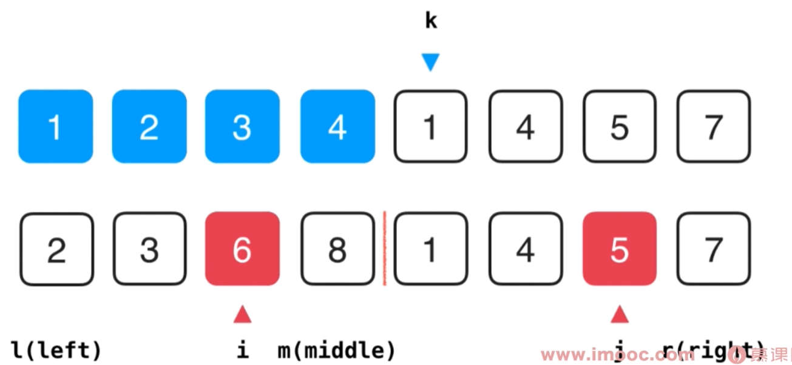

# 排序

### 选择排序 O(n2)

从后面选择最小的一个元素放到前面已排序的队列中

```c++
template<typename T>
void selectionSort(T arr[], int n) {
	for (int i = 0; i < n; i++) {
		//寻找[i,n）区间里的最小值
		int minIndex = i;
		for (int j = i + 1; j < n; j++)
			if (arr[j] < arr[minIndex])
				minIndex = j;
		swap(arr[i], arr[minIndex]);
	}
}
```


### 插入排序 O(n2)

当前元素，在前面已排序的队列中选择一个合适的位置插入

0位置已经自带排好序属性

对于相对有序的数组中，插入排序性能优越

```c++
void insertionSort(T arr[], int n) {
	for (int i = 1; i < n; i++) {
		//寻找元素arr[i]合适的插入位置
		T e = arr[i];
		int j;//j保存元素e应该插入的位置
		for (j = i; j > 0 && arr[j-1] > e; j--) {
			arr[j]=arr[j-1];
		}
		arr[j] = e;
	}
}
```

### 归并排序 O(nlogn)

迭代分半，排序，再归并排序

需要额外的临时存储空间



```c++
// 将arr[l...mid]和arr[mid+1...r]两部分进行归并
template<typename  T>
void __merge(T arr[], int l, int mid, int r){

    //* VS不支持动态长度数组, 即不能使用 T aux[r-l+1]的方式申请aux的空间
    //* 使用VS的同学, 请使用new的方式申请aux空间
    //* 使用new申请空间, 不要忘了在__merge函数的最后, delete掉申请的空间:)
    T aux[r-l+1];
    //T *aux = new T[r-l+1];

    for( int i = l ; i <= r; i ++ )
        aux[i-l] = arr[i];

    // 初始化，i指向左半部分的起始索引位置l；j指向右半部分起始索引位置mid+1
    int i = l, j = mid+1;
    for( int k = l ; k <= r; k ++ ){

        if( i > mid ){  // 如果左半部分元素已经全部处理完毕
            arr[k] = aux[j-l]; j ++;
        }
        else if( j > r ){  // 如果右半部分元素已经全部处理完毕
            arr[k] = aux[i-l]; i ++;
        }
        else if( aux[i-l] < aux[j-l] ) {  // 左半部分所指元素 < 右半部分所指元素
            arr[k] = aux[i-l]; i ++;
        }
        else{  // 左半部分所指元素 >= 右半部分所指元素
            arr[k] = aux[j-l]; j ++;
        }
    }
}

// 递归使用归并排序,对arr[l...r]的范围进行排序
template<typename T>
void __mergeSort(T arr[], int l, int r){

    if( l >= r )
        return;

    int mid = (l+r)/2;
    __mergeSort(arr, l, mid);
    __mergeSort(arr, mid+1, r);
    if(arr[mid]>arr[mid+1])
    	__merge(arr, l, mid, r);
}

template<typename T>
void mergeSort(T arr[], int n){

    __mergeSort( arr , 0 , n-1 );
}
```

### 快速排序 O(nlogn)

选出一个数作为基点，将数列中元素小于基点的放前面，大于基点的元素放后面，迭代


```c++
// 对arr[l...r]部分进行partition操作
// 返回p, 使得arr[l...p-1] < arr[p] ; arr[p+1...r] > arr[p]
template <typename T>
int _partition(T arr[], int l, int r){

    // 随机在arr[l...r]的范围中, 选择一个数值作为标定点pivot
    swap( arr[l] , arr[rand()%(r-l+1)+l] );

    T v = arr[l];
    int j = l;
    for( int i = l + 1 ; i <= r ; i ++ )
        if( arr[i] < v ){
            j ++;
            swap( arr[j] , arr[i] );
        }

    swap( arr[l] , arr[j]);

    return j;
}

// 对arr[l...r]部分进行快速排序
template <typename T>
void _quickSort(T arr[], int l, int r){

    // 对于小规模数组, 使用插入排序进行优化
    if( r - l <= 15 ){
        insertionSort(arr,l,r);
        return;
    }

    int p = _partition(arr, l, r);
    _quickSort(arr, l, p-1 );
    _quickSort(arr, p+1, r);
}

template <typename T>
void quickSort(T arr[], int n){

    srand(time(NULL));
    _quickSort(arr, 0, n-1);
}
```

## 堆 O(nlogn)

树形结构以树主形式存储，只关注最大或最小值


```c++
template<typename Item>
class MaxHeap{

private:
    Item *data;
    int count;
    int capacity;

    void shiftUp(int k){
        while( k > 1 && data[k/2] < data[k] ){
            swap( data[k/2], data[k] );
            k /= 2;
        }
    }

    void shiftDown(int k){
        while( 2*k <= count ){
            int j = 2*k; // 在此轮循环中,data[k]和data[j]交换位置
            if( j+1 <= count && data[j+1] > data[j] )
                j ++;
            // data[j] 是 data[2*k]和data[2*k+1]中的最大值

            if( data[k] >= data[j] ) break;
            swap( data[k] , data[j] );
            k = j;
        }
    }

public:
    // 构造函数, 构造一个空堆, 可容纳capacity个元素
    MaxHeap(int capacity){
        data = new Item[capacity+1];
        count = 0;
        this->capacity = capacity;
    }

    ~MaxHeap(){
        delete[] data;
    }

    // 返回堆中的元素个数
    int size(){
        return count;
    }

    // 返回一个布尔值, 表示堆中是否为空
    bool isEmpty(){
        return count == 0;
    }

    // 像最大堆中插入一个新的元素 item
    void insert(Item item){
        assert( count + 1 <= capacity );
        data[count+1] = item;
        shiftUp(count+1);
        count ++;
    }

    // 从最大堆中取出堆顶元素, 即堆中所存储的最大数据
    Item extractMax(){
        assert( count > 0 );
        Item ret = data[1];

        swap( data[1] , data[count] );
        count --;
        shiftDown(1);

        return ret;
    }

    // 获取最大堆中的堆顶元素
    Item getMax(){
        assert( count > 0 );
        return data[1];
    }

};
```

### C++优先队列使用_堆的方法

```c++
#include <iostream>
#include <queue>
#include <ctime>

using namespace std;

int main() {

    srand(time(NULL));

    // 默认的priority queue, 底层是最大堆
    priority_queue<int> pq;

    for(int i = 0 ; i < 10 ; i ++){
        int num = rand() % 100;
        pq.push(num);
        cout << "insert " << num << " in priority queue." << endl;
    }

    while(!pq.empty()){
        cout << pq.top() << " ";
        pq.pop();
    }

    cout << endl << endl;

    // 使用greater的priority queue, 底层是最小堆
    priority_queue<int, vector<int>, greater<int>> pq2;

    for(int i = 0; i < 10; i ++){
        int num = rand() % 100;
        pq2.push(num);
        cout << "insert " << num << " in priority queue." << endl;
    }

    while(!pq2.empty()){
        cout << pq2.top() << " ";
        pq2.pop();
    }

    cout << endl << endl;

    // 使用自定义Comparator的priority queue
    priority_queue<int, vector<int>, function<bool(int,int)>> pq3(myCmp);

    for(int i = 0; i < 10; i ++){
        int num = rand() % 100;
        pq3.push(num);
        cout << "insert " << num << " in priority queue." << endl;
    }

    while(!pq3.empty()){
        cout << pq3.top() << " ";
        pq3.pop();
    }

    return 0;
}
```


## 索引堆？

# 查找

## 二分查找


```c++
// 二分查找法,在有序数组arr中,查找target
// 如果找到target,返回相应的索引index
// 如果没有找到target,返回-1
template<typename T>
int binarySearch(T arr[], int n, T target){

    // 在arr[l...r]之中查找target
    int l = 0, r = n-1;
    while( l <= r ){

        //int mid = (l + r)/2;
        // 防止极端情况下的整形溢出，使用下面的逻辑求出mid
        int mid = l + (r-l)/2;

        if( arr[mid] == target )
            return mid;

        if( arr[mid] > target )
            r = mid - 1;
        else
            l = mid + 1;
    }

    return -1;
}
```

## 二分搜索树


```c++
#include <iostream>
#include <queue>
#include <cassert>

// 二分搜索树
template <typename Key, typename Value>
class BST{

private:
    // 树中的节点为私有的结构体, 外界不需要了解二分搜索树节点的具体实现
    struct Node{
        Key key;
        Value value;
        Node *left;
        Node *right;

        Node(Key key, Value value){
            this->key = key;
            this->value = value;
            this->left = this->right = NULL;
        }

        Node(Node *node){
            this->key = node->key;
            this->value = node->value;
            this->left = node->left;
            this->right = node->right;
        }
    };

    Node *root; // 根节点
    int count;  // 树中的节点个数

public:
    // 构造函数, 默认构造一棵空二分搜索树
    BST(){
        root = NULL;
        count = 0;
    }

    // 析构函数, 释放二分搜索树的所有空间
    ~BST(){
        destroy( root );
    }

    // 返回二分搜索树的节点个数
    int size(){
        return count;
    }

    // 返回二分搜索树是否为空
    bool isEmpty(){
        return count == 0;
    }

    // 向二分搜索树中插入一个新的(key, value)数据对
    void insert(Key key, Value value){
        root = insert(root, key, value);
    }

    // 查看二分搜索树中是否存在键key
    bool contain(Key key){
        return contain(root, key);
    }

    // 在二分搜索树中搜索键key所对应的值。如果这个值不存在, 则返回NULL
    Value* search(Key key){
        return search( root , key );
    }

    // 二分搜索树的前序遍历
    void preOrder(){
        preOrder(root);
    }

    // 二分搜索树的中序遍历
    void inOrder(){
        inOrder(root);
    }

    // 二分搜索树的后序遍历
    void postOrder(){
        postOrder(root);
    }

    // 二分搜索树的层序遍历
    void levelOrder(){

        queue<Node*> q;
        q.push(root);
        while( !q.empty() ){

            Node *node = q.front();
            q.pop();

            cout<<node->key<<endl;

            if( node->left )
                q.push( node->left );
            if( node->right )
                q.push( node->right );
        }
    }

    // 寻找二分搜索树的最小的键值
    Key minimum(){
        assert( count != 0 );
        Node* minNode = minimum( root );
        return minNode->key;
    }

    // 寻找二分搜索树的最大的键值
    Key maximum(){
        assert( count != 0 );
        Node* maxNode = maximum(root);
        return maxNode->key;
    }

    // 从二分搜索树中删除最小值所在节点
    void removeMin(){
        if( root )
            root = removeMin( root );
    }

    // 从二分搜索树中删除最大值所在节点
    void removeMax(){
        if( root )
            root = removeMax( root );
    }

    // 从二分搜索树中删除键值为key的节点
    void remove(Key key){
        root = remove(root, key);
    }

private:
    // 向以node为根的二分搜索树中, 插入节点(key, value), 使用递归算法
    // 返回插入新节点后的二分搜索树的根
    Node* insert(Node *node, Key key, Value value){

        if( node == NULL ){
            count ++;
            return new Node(key, value);
        }

        if( key == node->key )
            node->value = value;
        else if( key < node->key )
            node->left = insert( node->left , key, value);
        else    // key > node->key
            node->right = insert( node->right, key, value);

        return node;
    }

    // 查看以node为根的二分搜索树中是否包含键值为key的节点, 使用递归算法
    bool contain(Node* node, Key key){

        if( node == NULL )
            return false;

        if( key == node->key )
            return true;
        else if( key < node->key )
            return contain( node->left , key );
        else // key > node->key
            return contain( node->right , key );
    }

    // 在以node为根的二分搜索树中查找key所对应的value, 递归算法
    // 若value不存在, 则返回NULL
    Value* search(Node* node, Key key){

        if( node == NULL )
            return NULL;

        if( key == node->key )
            return &(node->value);
        else if( key < node->key )
            return search( node->left , key );
        else // key > node->key
            return search( node->right, key );
    }

    // 对以node为根的二分搜索树进行前序遍历, 递归算法
    void preOrder(Node* node){

        if( node != NULL ){
            cout<<node->key<<endl;
            preOrder(node->left);
            preOrder(node->right);
        }
    }

    // 对以node为根的二分搜索树进行中序遍历, 递归算法
    void inOrder(Node* node){

        if( node != NULL ){
            inOrder(node->left);
            cout<<node->key<<endl;
            inOrder(node->right);
        }
    }

    // 对以node为根的二分搜索树进行后序遍历, 递归算法
    void postOrder(Node* node){

        if( node != NULL ){
            postOrder(node->left);
            postOrder(node->right);
            cout<<node->key<<endl;
        }
    }

    // 释放以node为根的二分搜索树的所有节点
    // 采用后续遍历的递归算法
    void destroy(Node* node){

        if( node != NULL ){
            destroy( node->left );
            destroy( node->right );

            delete node;
            count --;
        }
    }

    // 返回以node为根的二分搜索树的最小键值所在的节点, 递归算法
    Node* minimum(Node* node){
        if( node->left == NULL )
            return node;

        return minimum(node->left);
    }

    // 返回以node为根的二分搜索树的最大键值所在的节点, 递归算法
    Node* maximum(Node* node){
        if( node->right == NULL )
            return node;

        return maximum(node->right);
    }

    // 删除掉以node为根的二分搜索树中的最小节点, 递归算法
    // 返回删除节点后新的二分搜索树的根
    Node* removeMin(Node* node){

        if( node->left == NULL ){

            Node* rightNode = node->right;
            delete node;
            count --;
            return rightNode;
        }

        node->left = removeMin(node->left);
        return node;
    }

    // 删除掉以node为根的二分搜索树中的最大节点, 递归算法
    // 返回删除节点后新的二分搜索树的根
    Node* removeMax(Node* node){

        if( node->right == NULL ){

            Node* leftNode = node->left;
            delete node;
            count --;
            return leftNode;
        }

        node->right = removeMax(node->right);
        return node;
    }

    // 删除掉以node为根的二分搜索树中键值为key的节点, 递归算法
    // 返回删除节点后新的二分搜索树的根
    Node* remove(Node* node, Key key){

        if( node == NULL )
            return NULL;

        if( key < node->key ){
            node->left = remove( node->left , key );
            return node;
        }
        else if( key > node->key ){
            node->right = remove( node->right, key );
            return node;
        }
        else{   // key == node->key

            // 待删除节点左子树为空的情况
            if( node->left == NULL ){
                Node *rightNode = node->right;
                delete node;
                count --;
                return rightNode;
            }

            // 待删除节点右子树为空的情况
            if( node->right == NULL ){
                Node *leftNode = node->left;
                delete node;
                count--;
                return leftNode;
            }

            // 待删除节点左右子树均不为空的情况

            // 找到比待删除节点大的最小节点, 即待删除节点右子树的最小节点
            // 用这个节点顶替待删除节点的位置
            Node *successor = new Node(minimum(node->right));
            count ++;//下面的count删除了两次，这次弥补

            successor->right = removeMin(node->right);
            successor->left = node->left;

            delete node;
            count --;

            return successor;
        }
    }
};
```


## 并查集 近乎O(1)


## 图

### 邻接矩阵、邻接表


### #稠密图 - 邻接矩阵

```c++
#include <iostream>
#include <vector>
#include <cassert>

using namespace std;

// 稠密图 - 邻接矩阵
class DenseGraph{

private:
    int n, m;       // 节点数和边数
    bool directed;  // 是否为有向图
    vector<vector<bool>> g; // 图的具体数据

public:
    // 构造函数
    DenseGraph( int n , bool directed ){
        assert( n >= 0 );
        this->n = n;
        this->m = 0;    // 初始化没有任何边
        this->directed = directed;
        // g初始化为n*n的布尔矩阵, 每一个g[i][j]均为false, 表示没有任和边
        g = vector<vector<bool>>(n, vector<bool>(n, false));
    }

    ~DenseGraph(){ }

    int V(){ return n;} // 返回节点个数
    int E(){ return m;} // 返回边的个数

    // 向图中添加一个边
    void addEdge( int v , int w ){

        assert( v >= 0 && v < n );
        assert( w >= 0 && w < n );

        if( hasEdge( v , w ) )
            return;

        g[v][w] = true;
        if( !directed )
            g[w][v] = true;

        m ++;
    }

    // 验证图中是否有从v到w的边
    bool hasEdge( int v , int w ){
        assert( v >= 0 && v < n );
        assert( w >= 0 && w < n );
        return g[v][w];
    }
};
```

### #稀疏图 - 邻接表

```c++
#include <iostream>
#include <vector>
#include <cassert>

using namespace std;

// 稀疏图 - 邻接表
class SparseGraph{

private:
    int n, m;       // 节点数和边数
    bool directed;  // 是否为有向图
    vector<vector<int>> g;  // 图的具体数据

public:
    // 构造函数
    SparseGraph( int n , bool directed ){
        assert( n >= 0 );
        this->n = n;
        this->m = 0;    // 初始化没有任何边
        this->directed = directed;
        // g初始化为n个空的vector, 表示每一个g[i]都为空, 即没有任和边
        g = vector<vector<int>>(n, vector<int>());
    }

    ~SparseGraph(){ }

    int V(){ return n;} // 返回节点个数
    int E(){ return m;} // 返回边的个数

    // 向图中添加一个边
    void addEdge( int v, int w ){

        assert( v >= 0 && v < n );
        assert( w >= 0 && w < n );

        g[v].push_back(w);
        if( v != w && !directed )
            g[w].push_back(v);

        m ++;
    }

    // 验证图中是否有从v到w的边
    bool hasEdge( int v , int w ){

        assert( v >= 0 && v < n );
        assert( w >= 0 && w < n );

        for( int i = 0 ; i < g[v].size() ; i ++ )
            if( g[v][i] == w )
                return true;
        return false;
    }
};
```


